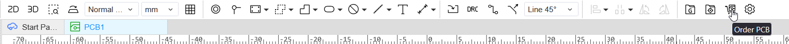
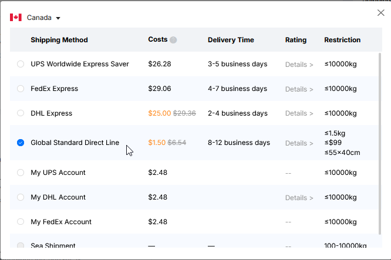

# EasyEDA Multi-Color Silkscreen Ordering Guide

To order your multicolor silkscreen keychain, open the PCB editor and click the Order PCB button in the top bar.

A couple of pop-ups will appear along the way. You can click yes/continue through them, and if it asks about DRC just skip it and move on. Once you're through, it'll redirect you to JLCPCB where you may need to log in.

From there, change the following settings to enable multicolor silkscreen:
1. Set your PCB color to white
2. Set the surface finish to ENIG
3. Under Advanced Options, set Silkscreen Technology to EasyEDA Multi-Color Silkscreen

Once that's done, add it to your cart and place your order! Make sure to select the cheapest available shipping method, which will most likely be Global Standard Direct Line. Do not select My UPS/DHL/FedEx Account.

That's it, your board is on its way! :D