# Week 4

> This week you'll be making your very own PCB kit, and as a prize you'll get your own kit shipped to you along with another random kit from a different person. This week will teach you about polishing and shipping your project, and it aims to create a sense of standards for your hardware projects.

## Prerequisites

This guide assumes you have some basic knowledge of PCB design and reading datasheets. If you don’t, don’t worry. You can read the [week 2 guide](https://resolution.hackclub.com/app/pathway/hardware/week/2) to get familiar with KiCad and the [week 3 guide](https://resolution.hackclub.com/app/pathway/hardware/week/3) to understand how to read datasheets.

## Intro

This week you're going to be making _yet_ another PCB, but this time there is a twist. You'll actually be designing your own PCB kit, and the kit you design will be shipped to someone random who submits this week. They'll get the opportunity to assemble it themselves.

So far you've just been designing PCBs for yourself, but now you'll learn how to build something and actually _ship it_ for other people to experience.

## Project Constraints

This week is very similar to week 3. You have the freedom to design your own PCB, but it should use the approved components and footprints listed below. You can use your week 3 project, but it is highly discouraged.

##### Approved Components List

- LEDs 
- Capacitors
- Resistors
- Potentiometer
- Buttons
- Transistors
- Diodes
- Buzzer (passive)
- ICs
	- NE555: Classic timer for blinking lights or generating pulses
	- CD4017: Count things and light up LEDs in sequence
	- LM556: Dual timer for more complex timing tasks
	- CD4060: Oscillator and counter all in one chip
	- CD4020: Long counter for timing events over many pulses
	- CD4040: Divide and count pulses for timing or sequencing
	- LM3914: Turn numbers into visual LED bar graphs
- USB A connector for power


Your footprints and symbols need to match the parts, so refer to the table below to see which symbol or footprint to use.
##### Symbol And Footprint Table

| Part            | Symbol          | Footprint                                        |
| --------------- | --------------- | ------------------------------------------------ |
| LED             | LED             | LED_D5.0mm                                       |
| Capacitor       | C               | C_Disc_D8.0mm_W5.0mm_P5.00mm                     |
| Capacitor       | C_Polarized     |                                                  |
| Resistor        | R               | R_Axial_DIN0204_L3.6mm_D1.6mm_P7.62mm_Horizontal |
| Potentiometer   | R_Potentiometer | Potentiometer_Bourns_3386P_Vertical              |
| Button          | SW_Push         | SW_PUSH-12mm                                     |
| Transistor      | Q_NPN, Q_PNP    | TO-92L_Inline_Wide                               |
| Diode           | D               | D_DO-15_P15.24mm_Horizontal                      |
| Buzzer          | Buzzer          | Buzzer_12x9.5RM7.6                               |
| NE555           | NE555P          | DIP-8_W7.62mm                                    |
| LM556           | LM556           | DIP-14_W7.62mm                                   |
| CD4017          | 4017            | DIP-16_W7.62mm                                   |
| CD4060          | 4060            | DIP-16_W7.62mm                                   |
| CD4020          | 4020            | DIP-16_W7.62mm                                   |
| CD4040          | 4040            | DIP-16_W7.62mm                                   |
| LM3914          | LM3914N         | DIP-18_W7.62mm                                   |
| USB A           | USB_A           | USB_A_Molex_67643_Horizontal                     |
| 2 Pin Connector | Conn_01x02      | PinHeader_1x02_P2.54mm_Vertical                  |

I highly recommend using a USB A port as your power source this week instead of a 2-pin connector. On a USB connector, VBUS is your positive rail and GND is your ground. You can leave the other pins unconnected.

## Getting Started

Before you start designing your PCB, take some time to _plan_ and clearly define what your project will be.

### Defining Your Project

Defining your project means answering two key questions:

a) What am I making?  
b) Who am I making this for?

Try to give answers that are specific, not vague. For example, saying "I'm gonna build a cool PCB" is too general. It does not clarify anything for you or others. A better answer would be "I'm gonna build a PCB dice that randomly generates numbers when pressed" and you can expand on how it works.

For the second question, consider the person who will receive your kit. Will they have the same experience and knowledge as you? Is your board and documentation clear enough for them to understand and assemble it successfully?

It is also a good idea to sketch or jot down what you want to make and list any features. Writing it down is better than trying to keep it all in your head.

If you are unsure what to build, you can search online for projects using the ICs or discrete components mentioned earlier and reference their schematics.


When you are designing a kit for someone else, there are a few practices you must follow. These include:

- Having a clean schematic
- Having a clean PCB design
- Having clear silkscreen labels on the PCB

These requirements should be the minimum standard for any of your projects. You may be wondering what exactly a clean schematic or clean PCB means. This will be explained in the sections below.

### Clean Schematics

As someone new to PCB design, you have probably heard people say you need clean schematics and that you should polish them up. You might not know exactly what a clean schematic is, so here is a small guide to help you understand what clean schematics look like.

#### 1. Readability

At a minimum, a schematic should be legible and easy to read.

What does this mean? It means you should avoid crowding your symbols, overlapping wires, or placing designators and values on top of each other.

An example of a poor schematic is shown here:

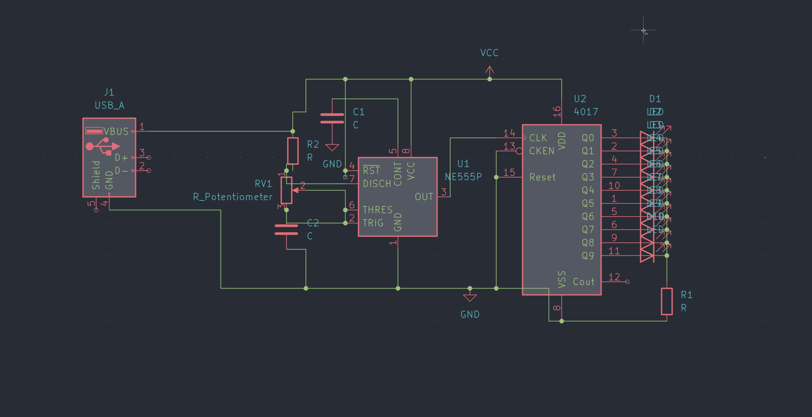

Many people new to PCB design end up with schematics like this. While the schematic may be technically correct, it is not easy to read. If someone were to review it, they would have to spend extra effort to figure out what is going on. Most reviewers simply do not want to do that, which means potential problems could go unnoticed.

The community expects you to put effort into making your schematics readable. When people see a poorly organized schematic, they often do not bother reviewing it because if the creator did not take time to polish it, why should the reviewer invest their time?

You may be wondering how to make your schematic better. Here are a few ways to improve the schematic above.

##### 1.1) Space Out Components

You should space out your components so that each part is clearly visible and wires have room to connect without overlapping. This makes the schematic easier to follow and reduces confusion when someone else is reviewing it.

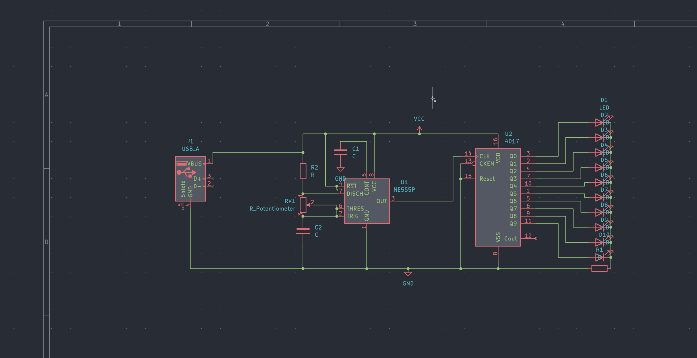

Now it already looks much better!

##### 1.2) No Overlapping

Make sure nothing overlaps in your schematic. Any designators that cover a symbol or symbols that overlap each other need to be fixed. Select and move your designators so they are clear and the schematic looks clean.

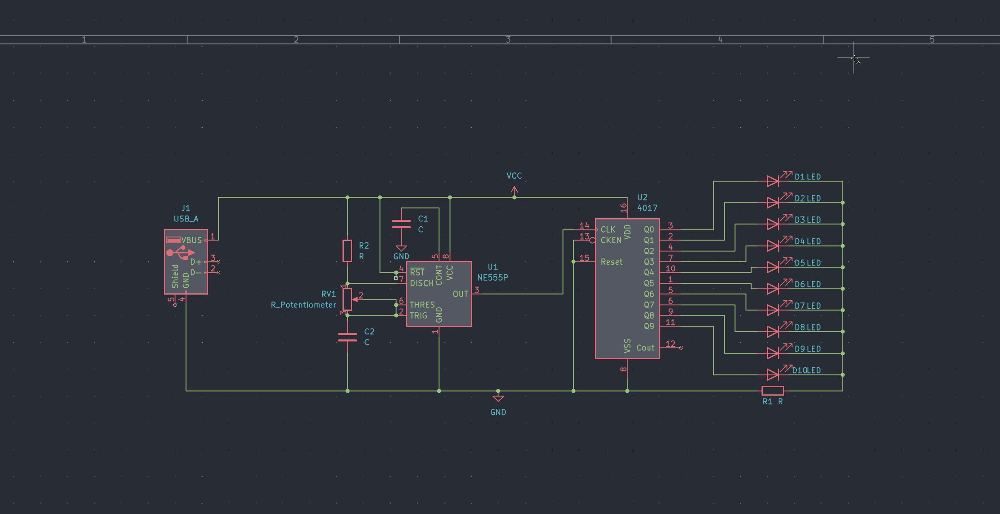

##### 1.3) Assign Component Values

You should always assign values to your components and align the text properly. Adding component values is important because it tells anyone reading your schematic exactly what each part is supposed to be. Without values, it is unclear whether a resistor is 10 kΩ or 1 kΩ, or what capacitor to use, which can lead to mistakes when building the PCB. Clear values make your schematic complete and easy to follow.

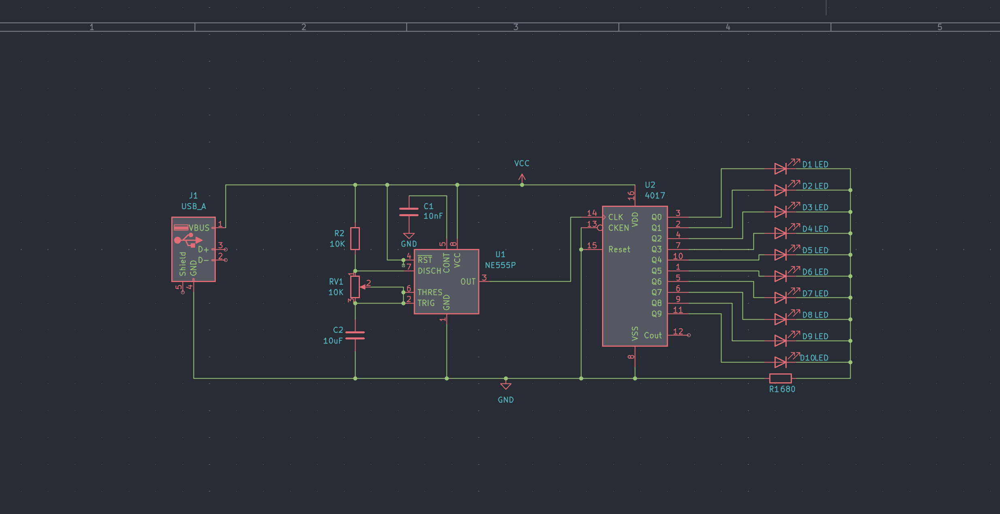

##### 1.4) Optimize Your Symbol

Default symbols often do not have the best pin layout for every use case. One way to make your schematic cleaner is to adjust symbols to have more logical pinouts. For example, the `CONT` pin on the 555 only has a 10 nF capacitor going to ground. The symbol looks much cleaner if we move the `CONT` pin closer to where it connects. You can do this by right-clicking the symbol, selecting `Edit with Symbol Editor`, then selecting the pin, moving it, and saving.

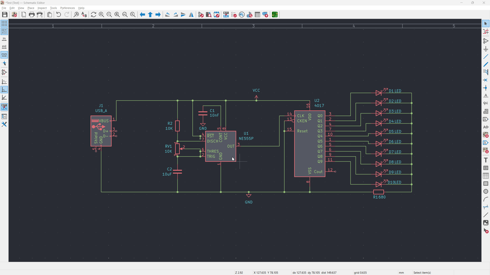

I also moved the `RST` pin to the top since it is only connected to VCC. After updating the symbol, I adjusted the schematic wiring to match. Notice how much cleaner the schematic looks now.

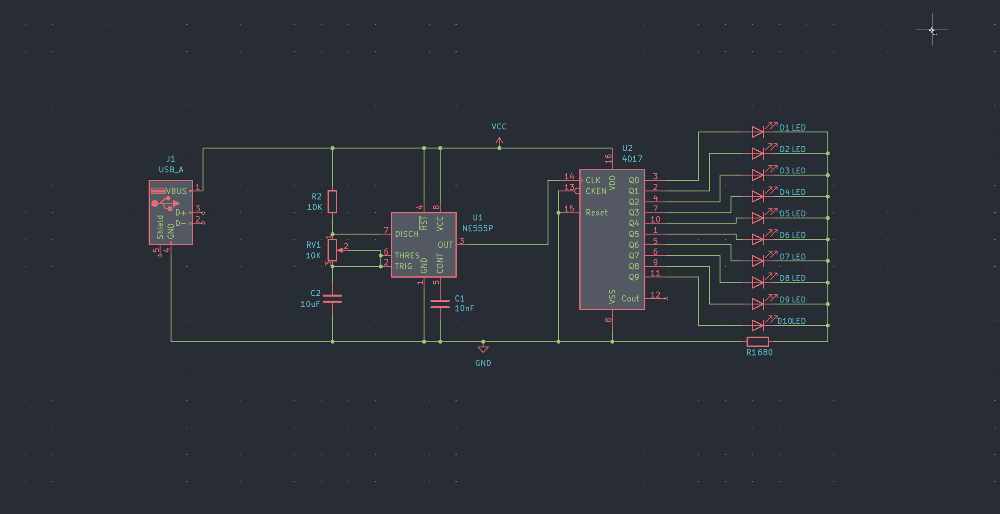

##### 1.5) Use Power Flag / Net Labels

In complex schematics, it is often better to use net labels to identify signals instead of drawing long wires across the schematic. This works well when the same signal connects to multiple parts that are far apart. However, using too many net labels for simple connections can make the schematic harder to follow.

Power flags work the same way for supply lines like VCC and GND. Even if the USB connector is directly wired and the schematic is not too messy, it is usually better to separate the power supply from the analog or signal sections. This makes the schematic easier to read and clearly shows which parts are connected to power. I will separate the USB power from the analog section and use a power flag to connect it.

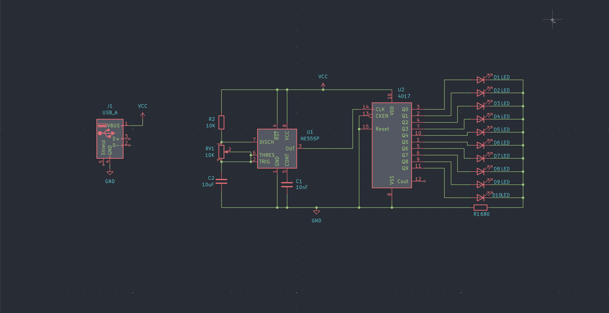

##### 1.6) Use NC Flag

For pins that are left unconnected, use the NC (No Connect) flag, which can be found on the right sidebar. This is important because it clearly indicates that the pin is intentionally unused. Without the NC flag, someone reviewing the schematic might think a connection is missing or that the design is incomplete.

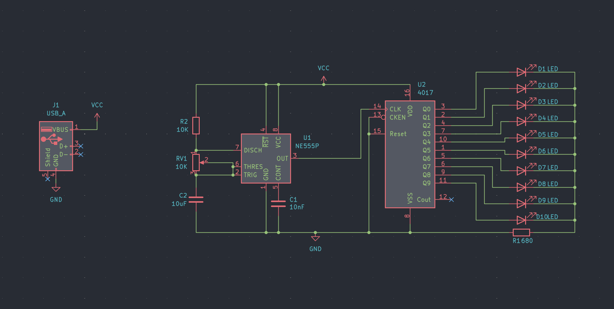


#### 2. Include Notes

Another good practice is including text notes in your schematic to explain the circuit. These notes do not need to be long paragraphs. Short, one-sentence notes are usually enough.

For example, you could add a note near the 555 IC explaining that Rx and Cx form an RC network and can be adjusted to control the signal. You could also include a small formula to show the maximum and minimum clock duration.

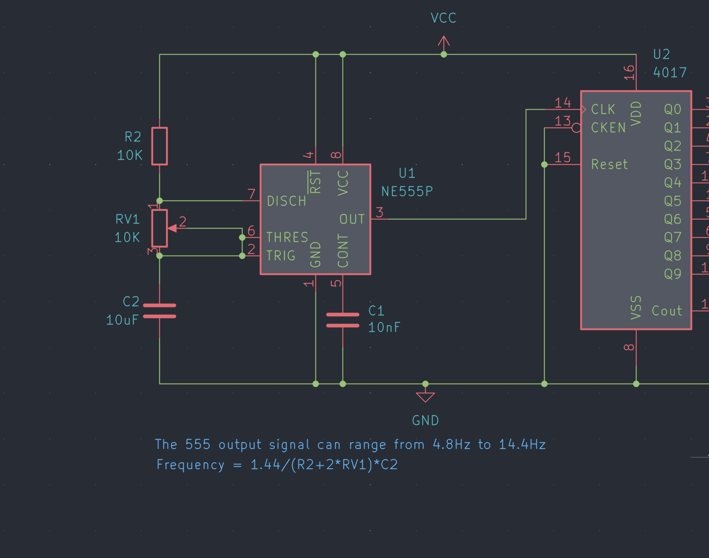

You can also add a note near whatever ICs you use briefly explaining what it does.

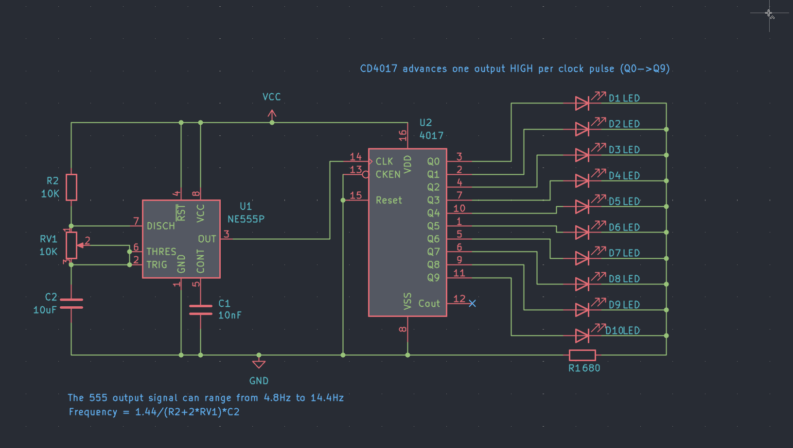

### Clean PCB

A clean PCB design is very important because this is how your board will physically look. Poor design can cause issues during assembly and create a bad experience for the person building it. Similar to schematics, a poorly routed PCB is frustrating to review, and most people will skip checking it for potential problems.

The key to a clean PCB design is making your board look intentional, not random.

Here are a few things to keep in mind while designing your PCB:

#### 1. Group Related Components Together

This is very important. You need to be intentional with your layout and not place parts randomly. For example, if your 555 has a potentiometer and capacitors connected to it in the schematic, place them near the corresponding pins on the PCB rather than scattering them across the board.

An easy way to group components while laying out is to open the schematic alongside the PCB editor. Selecting components in the schematic will also select them in the PCB editor, allowing you to move and arrange them more effectively.

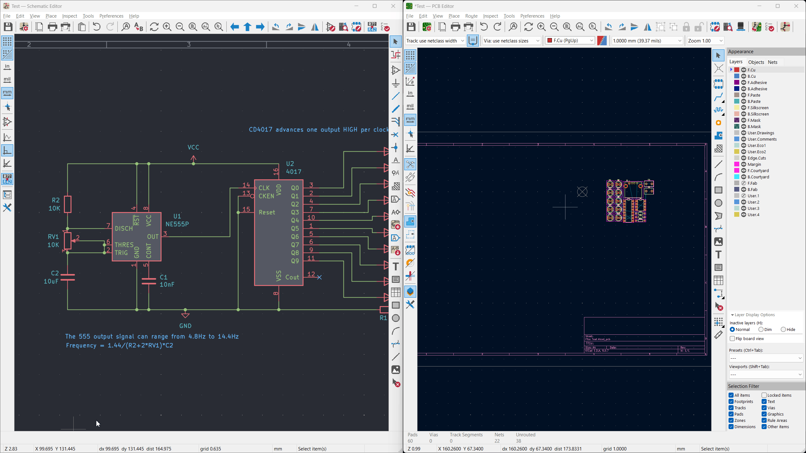

#### 2. Keep Components Aligned

If you have parts in a row or next to each other, take a few seconds to align them. This takes almost no effort but makes your PCB look much more polished.

An example of unaligned components is shown here:

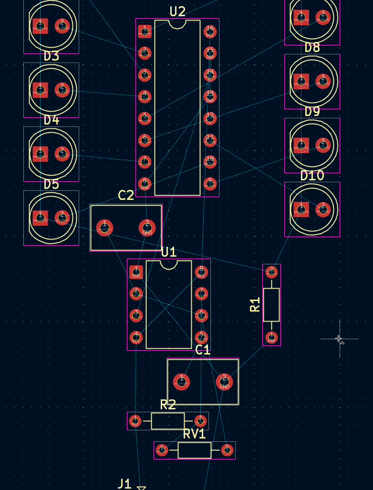

All you need to do is select the components, right-click, and choose align.

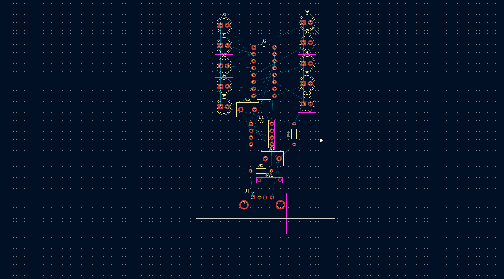

Now it looks much better, and it only took about 10 seconds to fix.

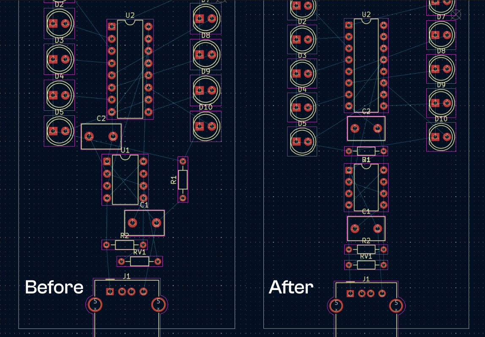

#### 3. Maintain Spacing

This is often overlooked, but it is important to leave enough space between components for soldering. Placing components too close together can make assembly difficult and increase the risk of solder bridges forming between pins. 

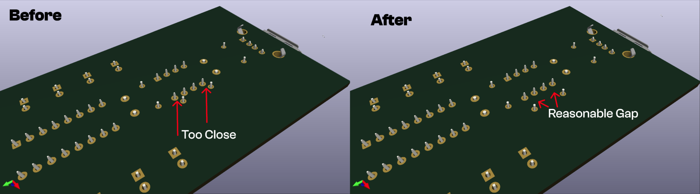

#### 4. Use A Ground Plane!!

I cannot stress this enough: you should almost always use a ground plane or pour. It makes your PCB much easier to route and cleaner, and it only takes a few seconds to implement.

A ground plane is a layer of your board filled with copper connected to the ground net. This means you no longer have to manually route dozens of ground pins together. I recommend either pouring the ground at the start and refilling it at the end or waiting until the end to do a ground pour on one layer.

There are many guides online showing how to create a ground plane in KiCad. Here is a quick method: click on `Draw Filled Zones`, then click on one of the board edges. Select a layer for the ground pour, ideally the layer with fewer signal traces, usually B.Cu, and set the net to GND. Draw a polygon that covers your board, and once it is closed, press `B` to fill the zone. Remember that every time you make changes or route new traces on that layer, you need to refill the zone.

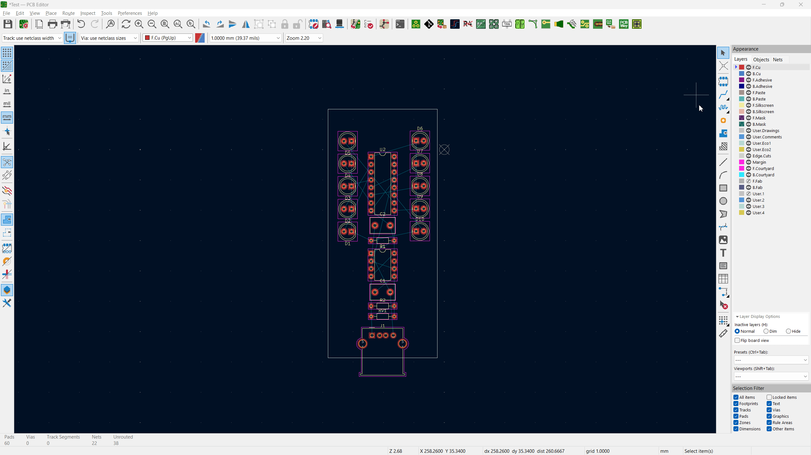

#### 5. Fillet Yo Corners!

Sharp PCB corners look unattractive and can actually cut you. It takes less than 5 seconds to fillet the corners, so make sure to do it.

To fillet corners, select the board outline, right-click, choose Shape Modification, and then select Fillet Corners.

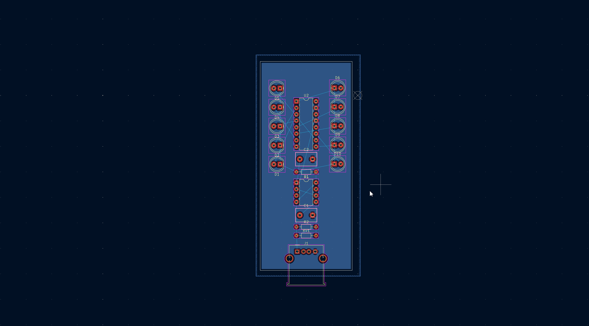


### Clear Silkscreen Labels

Silkscreen is extremely important for PCBs. All the yellow text in your PCB editor will be printed on the board, and it helps anyone assembling your PCB understand which footprint gets which part or value and how to place it correctly.

Ask yourself, "Can someone place every part correctly without guessing?"

A few things to keep in mind for silkscreen are:

#### 1. No Overlapping

Silkscreen designators or other text should never overlap. This is easy to fix, but many boards ignore it, resulting in a sloppy looking PCB.

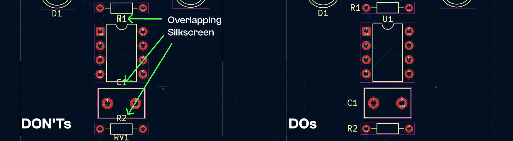

#### 2. Include Reference Designators and Values

Reference designators (R1, C1, U1, etc.) should always be present on your board to make it easier to identify which component goes where. If there is enough space, you should also include component values such as 10 k, 100 nF, NE555, and so on.


#### 3. Keep Text Aligned and Consistent

Make sure your text is properly aligned and consistent, using the same orientation whenever possible. Keep labels close to their respective components so there is no ambiguity.

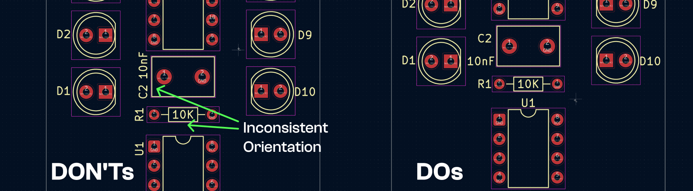

#### 4. Labels Connectors

This is SUPER important and something a lot of people skip over, if you're adding connectors on your board for power or anything off board you NEED to label it and make it clear what each pin is.


>For this week your PCB should also have the link to the projects Github repository on the silkscreen

## Shipping Your Project

Once you are done designing your PCB, it is time to properly _ship_ your project. What exactly is a _shipped_ project?

A shipped project is one that is understandable and usable by someone else. You are essentially packaging everything someone would need to build the project. If someone opens your repository, they should be able to see, understand, and recreate your project without asking questions or getting confused.

Your goal when shipping your project is to make it as clear, complete, and easy to use as possible.

At a minimum, a shipped project should include the following:

#### 1. All Project Files

Your repository should include all the files for your project. This includes:

##### Source Files
Source files are your four KiCad files: `.kicad_pcb`, `.kicad_prl`, `.kicad_pro`, and `.kicad_sch`. These files allow others to view or modify your design if they want to make changes.

##### Production Files
Production files include your gerbers, BOM, designators, and other files required to order your board. These can be generated using the KiCad Fabrication Plugin, which is covered in the week 2 guide, but there are also many tutorials online.

##### 3D Board STEP File
This is a 3D file of your board, which can be exported from the PCB editor by going to File -> Export -> STEP. Including this in your repository is important because it allows others to visualize the board in 3D, check component placement, and even create renders.

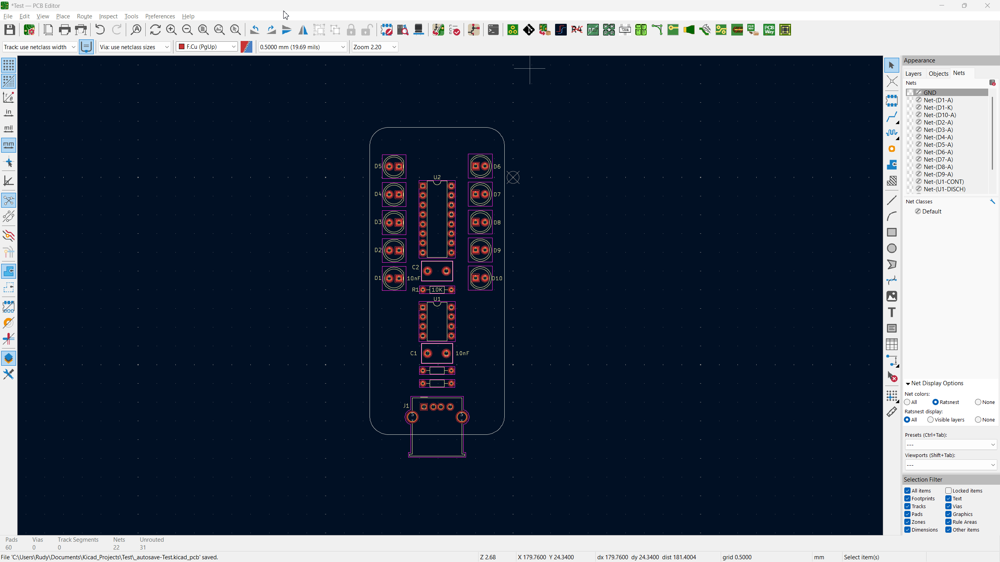

#### 2. Organized Repository

Organizing your repository is very important and only takes about a minute. It can make your repository look much more professional. The key is to create folders for different types of files instead of dumping everything into the root folder.

One approach is to create a `production` folder and a `PCB` folder. The `production` folder should include all your production files, while the `PCB` folder can have a `src` subfolder containing your KiCad source files.

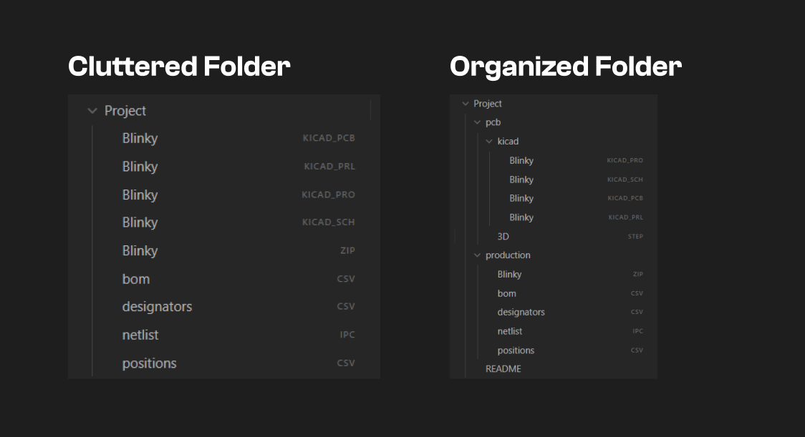

Additionally, if you have images referenced in your README or Journal, do not leave them in the root folder. Create a separate `attachments` folder to keep them organized.


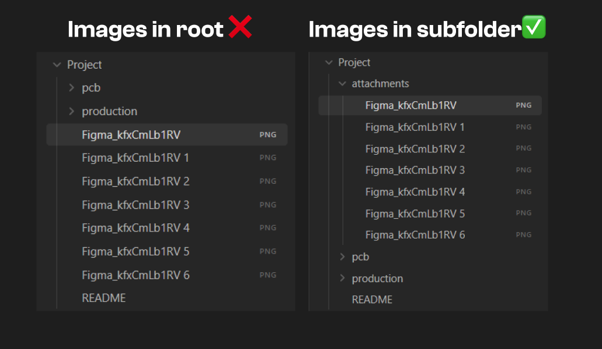

Here's an example of a good repository template:

```
project-root/
├─ attachments/
│  ├─ image1.png
│  ├─ image2.png
│  └─ image3.png
├─ production/
│  ├─ gerber.zip
│  ├─ bom.csv
│  ├─ designator.csv
│  ├─ position.csv
│  └─ netlist.ipc
├─ src/
│  ├─ kicad/
│  │  ├─ kicad.sch
│  │  ├─ kicad.pcb
│  │  └─ kicad.prj
│  └─ 3D.STEP
├─ Journal.md
└─ README.md
```

#### 3. A Clear README.md

Your repository must include a `README.md`, and it should be clear enough that someone can understand your project immediately and know where everything is.

Your README should include the following:

1. Short description of what the project is and how it works
2. Image or render of the PCB
3. Features or highlights (optional bullet list of key functionality)
4. Schematic image
5. PCB image
6. BOM in table format
7. Assembly or usage notes
8. Any details that will aid the end user

Your README should also be nicely formatted. Embed links using markdown rather than pasting long URLs, use headings properly, and keep the layout clean. READMEs use markdown, so you can create one in any markdown editor (I personally use Obsidian). If you are not familiar with markdown, you can use [https://readme.so/editor](https://readme.so/editor).

A well-organized README would look something like this:

```
# Project Title

I made a thing which does a cool thing, it uses two cool things to light up some other cool things.


## Features (optional)

The board does:
- a cool thing
- another cool thing
- anything else 
  
## Schematic


## PCB


## BOM

| Designator | Value |
| ---------- | ----- |
| R1         | 10K   |
| C1         | 100nF |
| U1         | NE555 |

## Assembly / Usage

[Add assembly details]

[Add Usage notes]

  
```


### 4. Make A Render

Shipping is all about polishing your project, and you can never have too much polish. One way to make your repository look impressive is to create a detailed render of your PCB.

To get a render, first export your PCB as a STEP file. Once you have the STEP file, you can open it in your preferred CAD or 3D modeling tool. If you have never used a CAD tool, I suggest using either Fusion 360 or OnShape. Fusion 360 is a powerful desktop application for 3D modeling and mechanical design, while OnShape is a cloud-based CAD tool that works in your browser and does not require installation.

I am more familiar with Fusion 360, so I will use that, but the steps are very similar in most CAD tools. First, I will open the STEP file in Fusion 360.

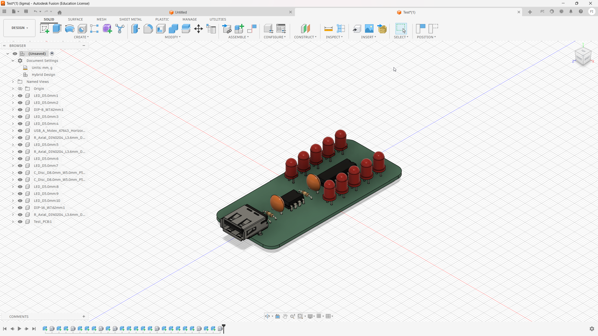

Once the STEP file is loaded, switch to the rendering tab. Here you can adjust lighting, reflections, and other settings to create a polished model. There are many tutorials online if you want more guidance, just search for PCB rendering in Fusion 360 or your preferred tool.


I’m going to do something different. I’ll go back to the design tab, set my visual style to wireframe with visible edges because I like that aesthetic, and turn off the grids.

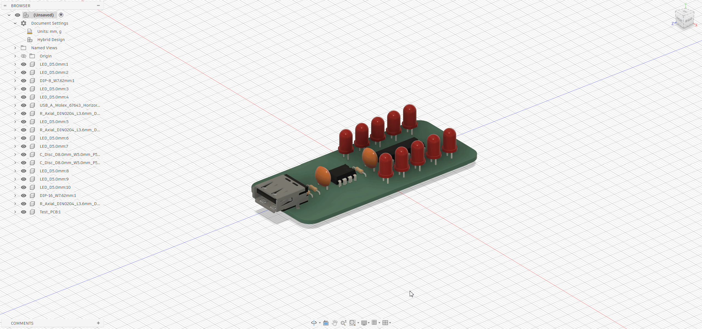

Once the camera is positioned the way I want, I’ll export the image by selecting File -> Capture Image. You can choose a transparent background or not. With a transparent background, only the board outlines are visible, and everything else is transparent.


### 5. Make A Banner

Another way to polish your project is to take the render you just made and create a banner with it.

You can make a banner in practically any software. There are many free options, such as Photopea, Canva, or Figma.

I’ll be using Figma since I’m most familiar with it. I’ll create a **1280 px × 640 px** frame and drop my render into it.

Then I’ll add some text, like the project name and my GitHub, and just like that, it already looks much more impressive.

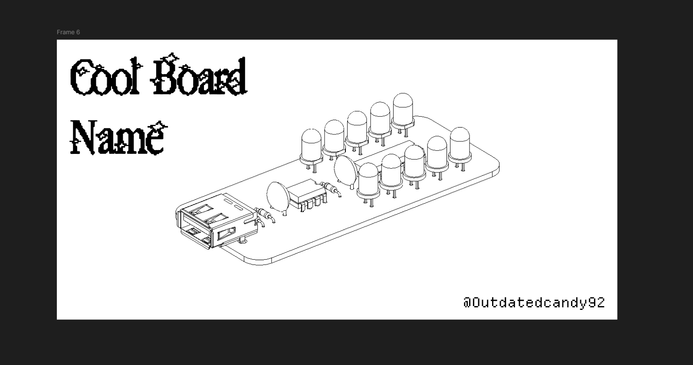
Using this as the main image for your README instantly makes your project look ten times more professional, and it only took about five minutes to create.

## Submitting

Now that everything is done, you can get ready to submit your project. Make sure your GitHub repository includes the following:

- A detailed `README.md`
- A `Journal.md` (if you are journaling your progress)
- KiCad source files (`.sch`, `.pcb`, `.prj`)
- Production files (Gerbers)

You also need to ensure that your repository is formatted nicely. An example structure could look like this:

```
project-root/
├─ attachments/
│  ├─ image1.png
│  ├─ image2.png
│  └─ image3.png
├─ production/
│  ├─ gerber.zip
│  ├─ bom.csv
│  ├─ designator.csv
│  ├─ position.csv
│  └─ netlist.ipc
├─ src/
│  ├─ kicad/
│  │  ├─ kicad.sch
│  │  ├─ kicad.pcb
│  │  └─ kicad.prj
│  └─ falstad/
│     └─ falstad.txt (if required)
├─ Journal.md
└─ README.md
```

In your `README.md`, make sure you include the following:

- [ ] A Title
- [ ] Project Overview
- [ ] PCB Render Image
- [ ] Schematic Image
- [ ] PCB Image
- [ ] A BOM In Table Format

Your PCB should HAVE the link to the project's github repository!

### How do I Journal / What the heck even is Journaling? 

Journaling basically means writing down and documenting how you designed your project, what was going on in your head, the problems you ran into, and how you solved them.

A solid hardware design journal should document both what you built and how you thought about building it. The goal is that someone (including future you) can understand the reasoning, reproduce the project, and learn from the mistakes.

A good journal includes the following things:

- Project Goal
- Initial Idea/Research
- Detailed Design
- Testing
- Problems Encountered
- Iterations/Improvements
- Reflection

A good rule of thumb is that your journal should answer these three main questions:

1. Why did I design it this way?
2. How did I build it?
3. What happened when I tested it?

An example template for journaling a hardware project could look like this:

```
# Project Name

[Preface] I'm building X because of Y.

## Date - [Heading]

Today I worked on X.


I ran into this issue, so I researched it and found X.

### Time Spent: X Hours

## Date - [Heading]

Today I fixed the X issue by doing Y.


### Time Spent: X Hours

```

Now you might be wondering how to actually journal.

You can use basically any editor you like and write about your daily progress. I highly recommend using markdown to format your journal, since it is simple and renders nicely on GitHub.

I personally use [Obsidian](https://obsidian.md/) for journaling because it is my go to notes app and it supports markdown, but you can use whatever you prefer.

To journal, simply create a `Journal.md` file and start writing in it.


