- Intro 
	- What we're making
- Getting Started
	- EasyEDA signup
	- UI Basics
	- PCB Editor
		- Tools
		- Layers
			- Board Outline
			- Copper Layer
			- Silkscreen
			- Soldermask
- Making the Keychain
	- Planning and Artwork
	- Board Outline
	- Importing Image
	- Keychain Hole
- Exporting & Ordering
	- JLCPCB Guide and settings
- Submitting
	- Requirements
---

# Let's Make A PCB Keychain

> We’ll be designing a PCB keychain in EasyEDA and using its multicolor silkscreen feature to make the coolest keychain ever. Once your project gets approved, you’ll get a grant to order your own keychain :D plus a picoducky if you put in 4 hours.

If you come up with a really cool art design, I’ll turn it into stickers for everyone in Resolution Hardware. I’ll also send you a bunch of extras so you can flex or share them with others.


## Getting Started

As mentioned, we’ll be using EasyEDA Pro to design our PCB since it supports multicolor silkscreen with JLCPCB. To get started, head over to [https://pro.easyeda.com](https://pro.easyeda.com), create an account, then click “Use Online” to open the editor.

### EasyEDA Basics

Once you’re in the editor, create a new project by going to File → New → Project, then name it whatever you like.

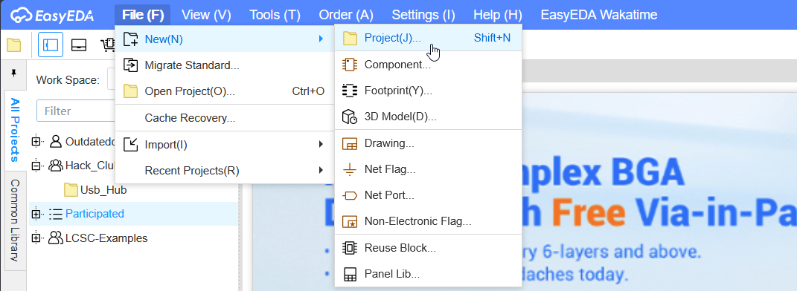

After creating the project, EasyEDA will open it and take you to the project home screen. It will look grey at first. To jump into the PCB editor, click the PCB icon in the left sidebar.

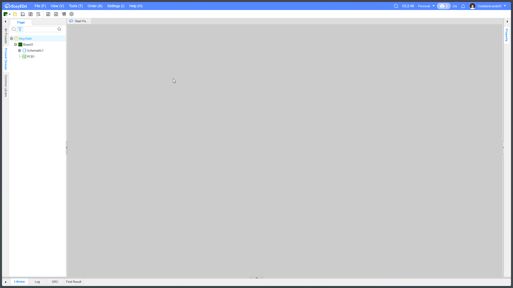

Inside the PCB editor, you’ll see a variety of tools along the top bar for placing components, drawing shapes, and editing your design. On the right sidebar, you’ll find the layer panel, which lets you switch between different PCB layers like the top layer, bottom layer, and silkscreen.

Before we go any further, make sure your units are set to mm instead of mil if they are currently in mil. You can change this from the top bar.

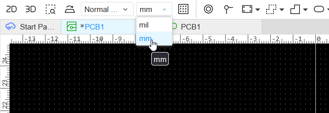

There are a lot of tools and layers, so it might feel a bit overwhelming at first, but don’t worry, we’re only going to use a few of them.

The main tool we care about is **Board Outline**, which is pretty self explanatory. You use it to draw the shape of your board. You can expand the tool to choose between a circle, rectangle, or polygon, depending on the shape you want.

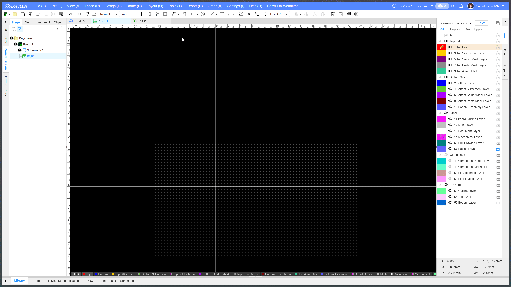

Now moving on to layers, there are really only four you need to worry about:
##### Board Outline

We already covered this. It’s the layer that defines the exact shape and size of your PCB. Anything you draw here becomes the physical edge of the board when it’s manufactured, so make sure your outline is clean and fully closed.
##### Top/Bottom Silkscreen Layer

This is where most of your artwork will go. The silkscreen is printed directly onto the PCB surface. Normally it’s a single color, but JLCPCB supports multicolor, so you can get creative with it.

There are two silkscreen layers, top and bottom. You can place anything you want on them using the text or shape tools, just make sure the layer is set to Top Silkscreen or Bottom Silkscreen.

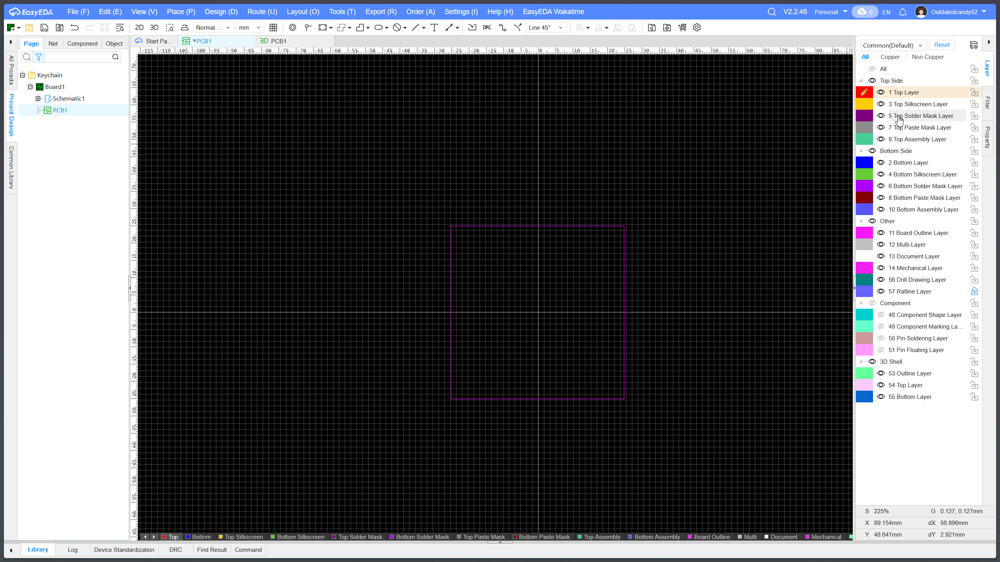

but EasyEDA is a EDA tool not an art tool so features are very limited and thats why we'll draw our art in a different software and then import these later!

##### Top/Bottom Layer

This is the copper layer, where you normally place your traces. Anything you draw on this layer within the board outline will be made of copper on the final PCB.

While it’s usually used for electrical routing, you can also use it creatively to add depth to your design. If the copper is exposed, it can have a gold finish, and if it’s covered with solder mask, it will appear as a different color and slightly recessed. This contrast lets you create more detailed and layered artwork.

You can use tools like the fill tool or text tool to draw shapes directly on the copper layer and incorporate them into your design.

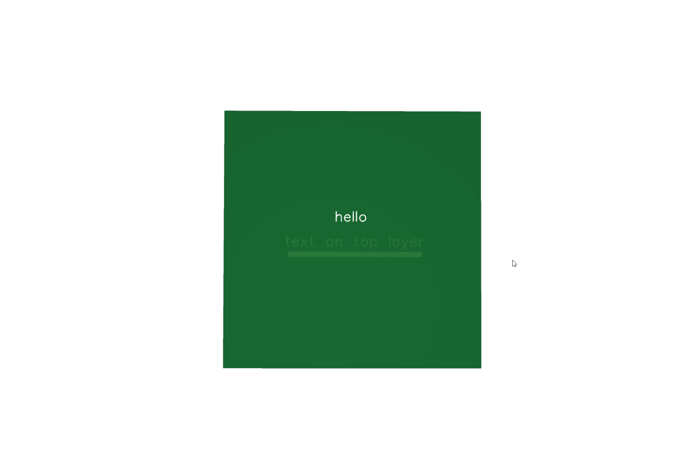

##### Top/Bottom Soldermask Layer

Soldermask is a non conductive layer that’s applied over the PCB and its copper to prevent accidental short circuits, protect the copper from oxidation, and make soldering easier. That’s why most PCBs are green, the green color is actually the soldermask.

We can also use this layer creatively. By drawing on the soldermask layer, you’re essentially removing it from those areas. This can expose the bare board, which has a light brown or yellow color, or expose the copper underneath. Normally copper looks copper colored, but since we’re using ENIG, the exposed copper will be plated with gold.

Just like before, you can use any drawing tool, then set the layer to soldermask to remove it from specific areas.

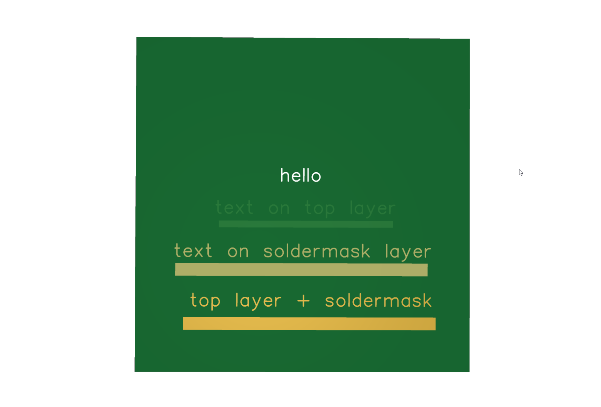

## Making The Keychain

> Please read through the entire guide first once before starting your project!

Now that we’ve covered the basics of EasyEDA, we can actually start making a keychain :D  
But before you jump into EasyEDA, you need a plan. That means creating your artwork first.

### Planning and Artwork

First things first, figure out what you want to make. You can sketch it on paper, your iPad, your computer, or whatever works for you. It doesn’t matter how you do it, just make sure you have a clear idea of how your design should look.

Think about where you want to place the keychain hole, whether you want to use gold as part of your design, and any other details you want to include.

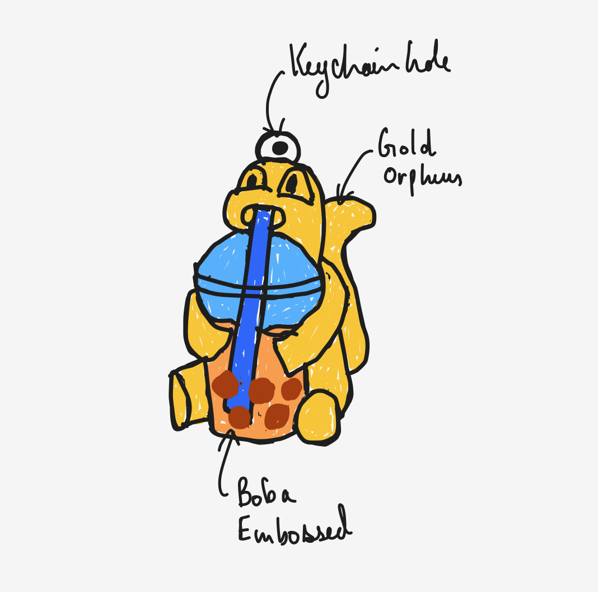

You can design your artwork in whatever software you like, whether it’s Procreate, Photoshop, Figma, Canva, or anything you’re comfortable with. It’s best if your design uses layers, since we may need to export certain parts separately.

If you’re not super confident with art, don’t worry. Just try your best and have fun with it.

You can also lean into graphic design by taking an existing design and remixing it into something cooler :D

For example, I really like the Orpheus boba sticker, so I’ll base my design on that. Instead of using it as is, I’ll make a few changes. I’ll remove the Hack Club flag since it’s too small to print well, create a full outline, and make Orpheus gold using Photoshop. I’ll also keep boba on a separate layer because I want it to stand out with an embossed effect.

I won’t go over the Photoshop steps here since that’s something you can easily look up. The goal is to show you the overall process so you know how to approach each step.


I’ll export my image as four separate layers: one for the outline, one for the full drawing, one for the gold layer, and one for the boba.


Now we can import everything into EasyEDA.

### Board Outline

To import the board outline, you can’t just use the image directly. It needs to be converted into a DXF file first. For that, head over to convertio.co/jpg-dxf and upload your outline layer.

The important part here is that your outline should be a single, clean, closed shape with no extra elements, so the conversion stays accurate.

Once it’s converted, import it into EasyEDA by going to File → Import → DXF and selecting your file. Make sure to adjust the scaling ratio so the final shape is under 100 by 100 mm. In my case, I had to use a scaling ratio of 0.15.


Next, we clean up the DXF by removing anything duplicated. For example, if there are two outlines, you should delete the inner one and keep only the main outer shape. After that, select the outline and change its layer from the top layer to the board outline layer.

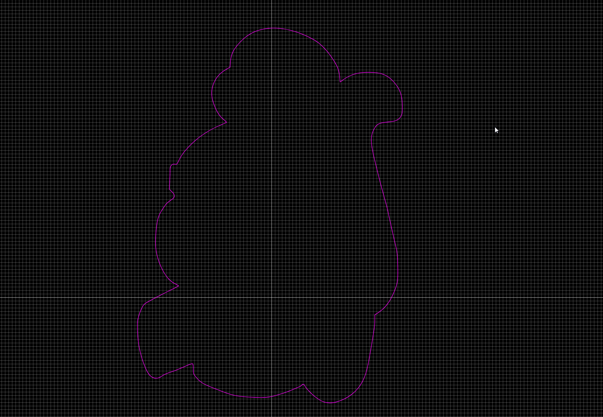

If you open the 3D viewer now, you should be able to see your finished board shape :D

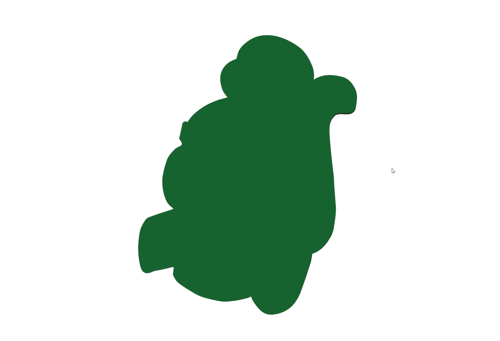

### Importing Image

Now that we have our outline, we can import our images. The process is pretty similar. Go to File → Import → Image, then select your file. Make sure to tick the option for JLC multicolor silkscreen in the dialog, then place it onto your board.

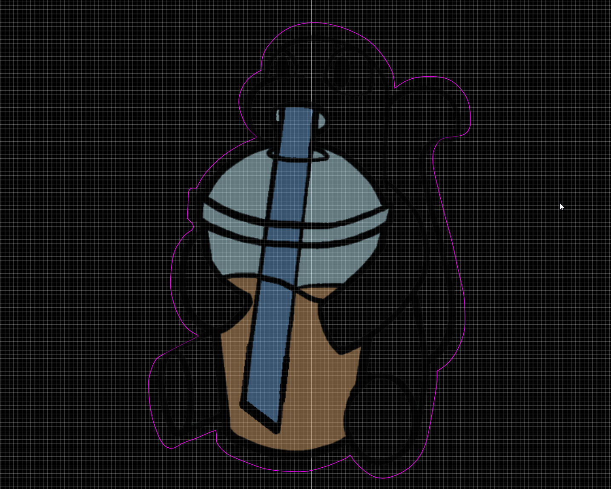

If the size does not match your outline, you can simply select it and scale it uniformly by holding Shift while resizing until it fits properly.

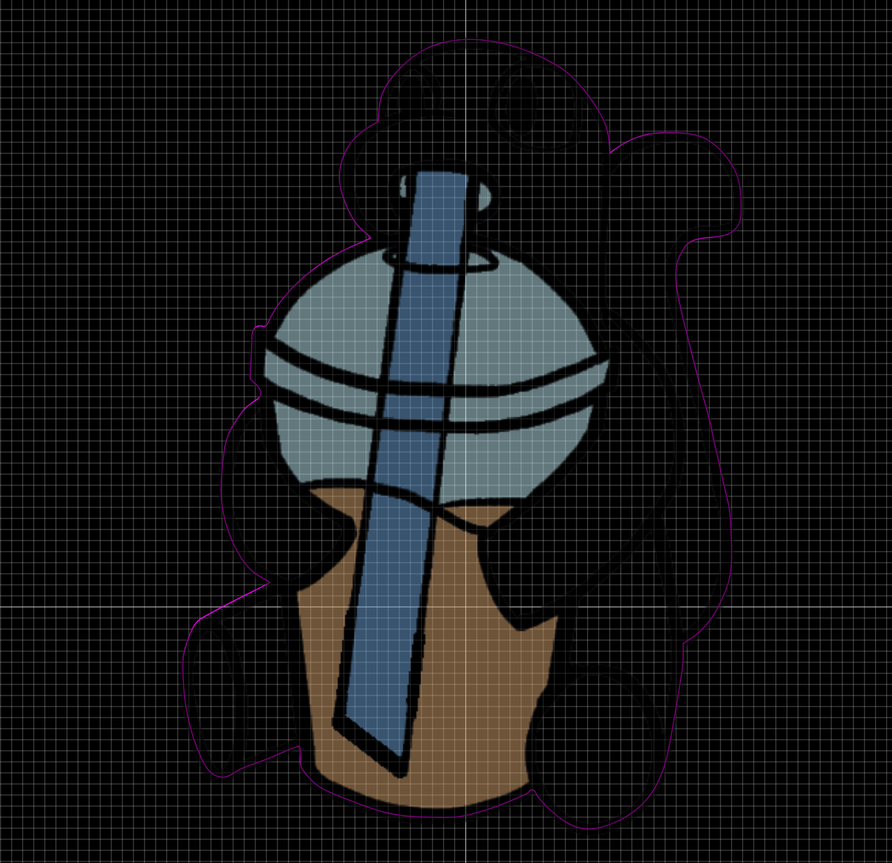

here is the resized proper image^

If you want to look at this in the 3D viewer, you need to make sure to set the silkscreen technology as colorful silkscreen in the viewer.

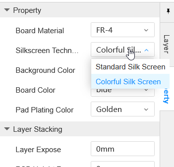

### Gold Layer

The process for creating a gold layer is very similar. First, import the layer you want to use as gold. You can import it as a multicolor layer if you like, but it is not required. Align it properly and resize it if needed so it matches your design.

Next, change its layer to Top Copper. After that, duplicate it using Ctrl + C and Ctrl + V, then align the copy directly on top of the original and change its layer to Top Soldermask.

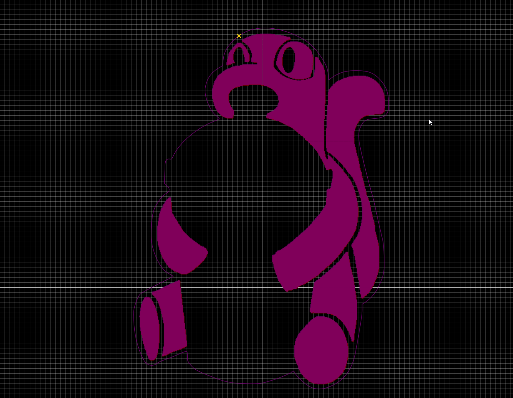

If it becomes difficult to select the correct layer and the silkscreen keeps getting in the way while you are moving and aligning the top copper and soldermask layers, you can simply hide it using the layers sidebar by clicking the eye icon to toggle visibility.

If you open the 3D viewer now, this is what you will see.

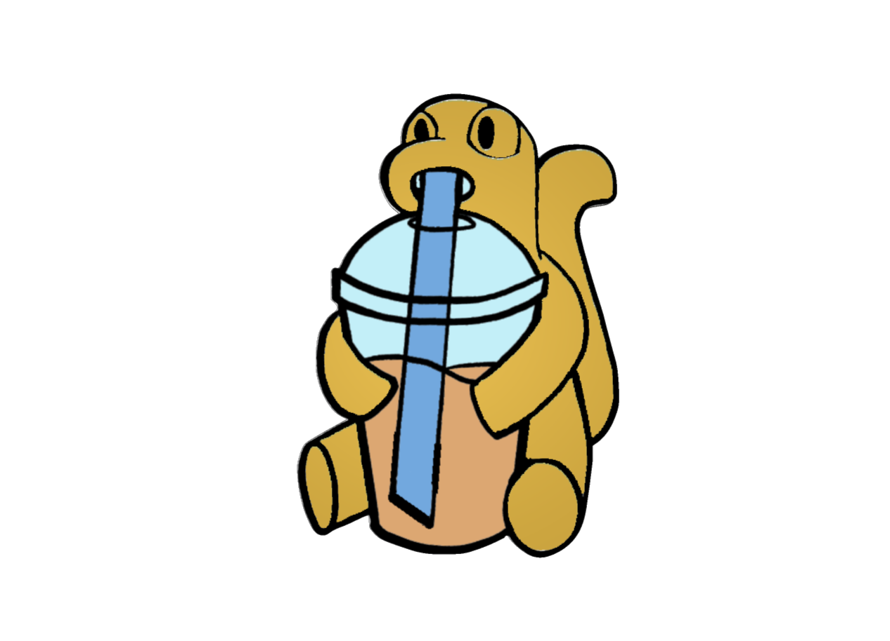

### Emboss Layer

If you want something embossed, meaning slightly raised off the board, you can use a copper layer without exposing it by removing the soldermask. This creates a subtle “popping” effect on the final PCB.

I’ll do this for my boba design. The steps are similar to before. First, I’ll import the image as a multicolor layer, then resize and align it if needed. After that, I’ll import it again, but this time not as a multicolor image, then set its layer to Top Copper and place it directly over the boba silkscreen.

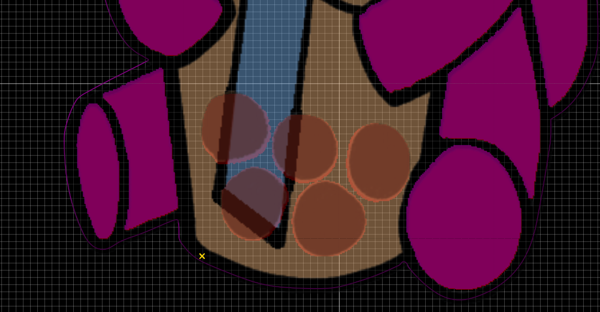

It might not look very obvious in the 3D viewer, but there will still be a slight embossed effect in the final board.

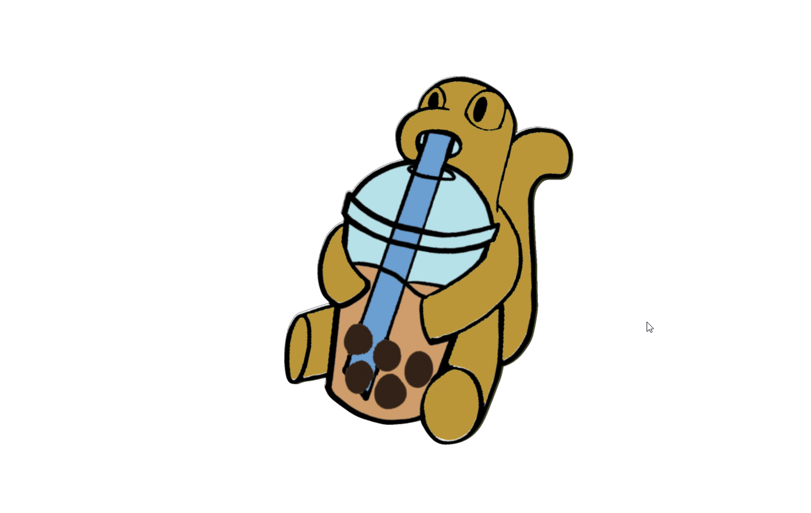


### Keychain Hole

To create a hole in your board, you need to use the slot tool, which can be found in the top bar. Before placing the hole, I’ll first create a small circular board outline that overlaps the current board outline, then merge them together.

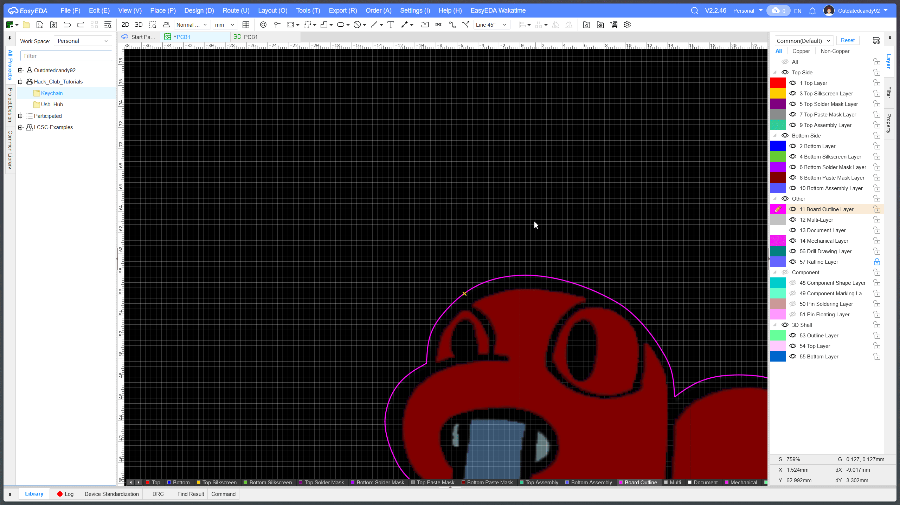

Next, I’ll add a hole using the slot region tool in the top bar, placing it inside that small circle. I’ll set the radius to 1.5 mm, giving a 3 mm hole, which should be more than enough for a keychain.


And there you're all done!

## Submitting

>If you're doing artwork you need to use Lapse to track hours, Journaling will NOT be accepted as a valid form and will lead to heavy hour deflation. This week I highly recommend only using Lapse.

Now that everything is done, you can get ready to submit your project. Make sure your GitHub repository includes the following:

- A detailed `README.md`
- EasyEDA source file (File->Save As->Project Save As (local))
- Production files (Gerbers) (File->Export->PCB Fabrication Files)
- Artwork source files (is avaible)

You also need to ensure that your repository is formatted nicely. An example structure could look like this:

```
project-root/
├─ attachments/
│  ├─ image1.png
│  ├─ image2.png
│  └─ image3.png
├─ production/
│  └─ gerber.zip
├─ src/
│  ├─ keychain.Epro
|  └─ artwork.psd
└─ README.md
```

In your `README.md`, make sure you include the following:

- [ ] A Title
- [ ] What the project is
- [ ] PCB Render Image
- [ ] Anything fun you wanna add :D

Your demo link should be the link to your EasyEDA project. To get it, click your project in the sidebar, then go to Project Management → Share

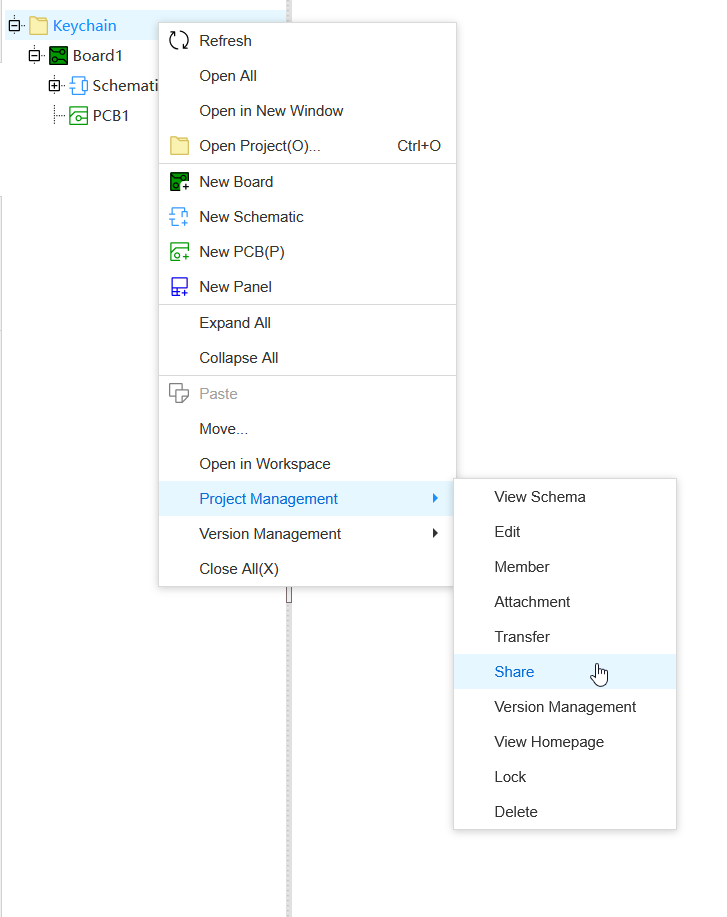

You will see a popup saying a new page called OSHWLAB.com will open. Click continue, then on that page click the “Save to drafts” button. You do not need to worry about the cover image or anything else.

Once that is done, go back to your project in the editor and simply copy the browser link. That is your demo link.