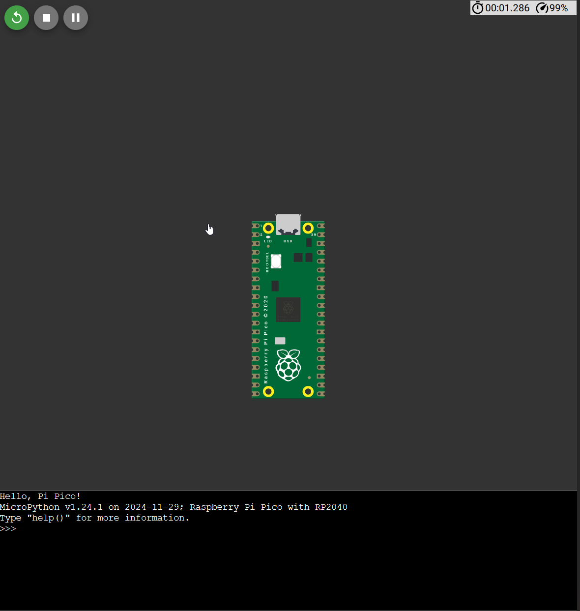
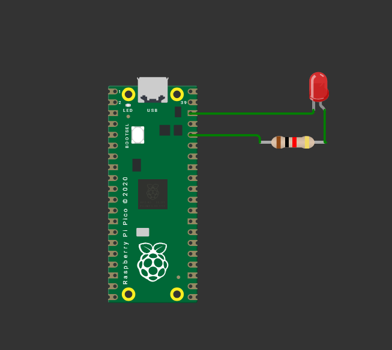
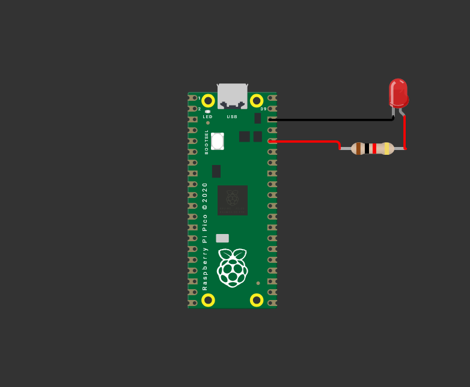
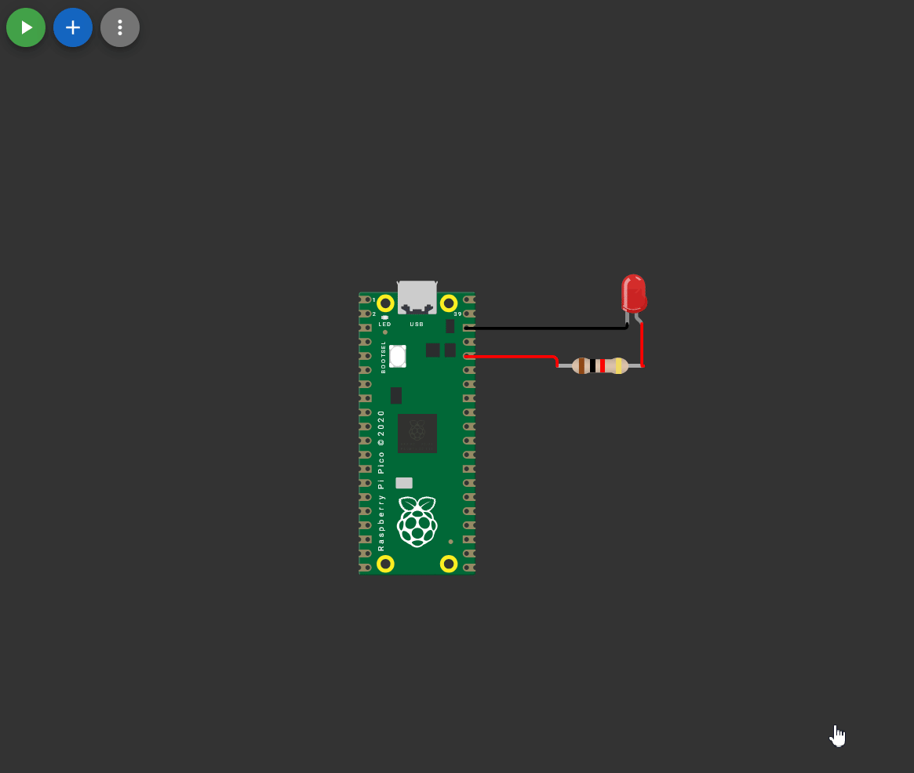
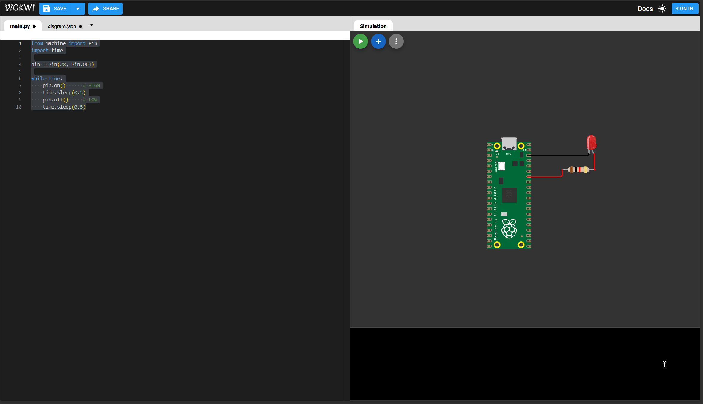
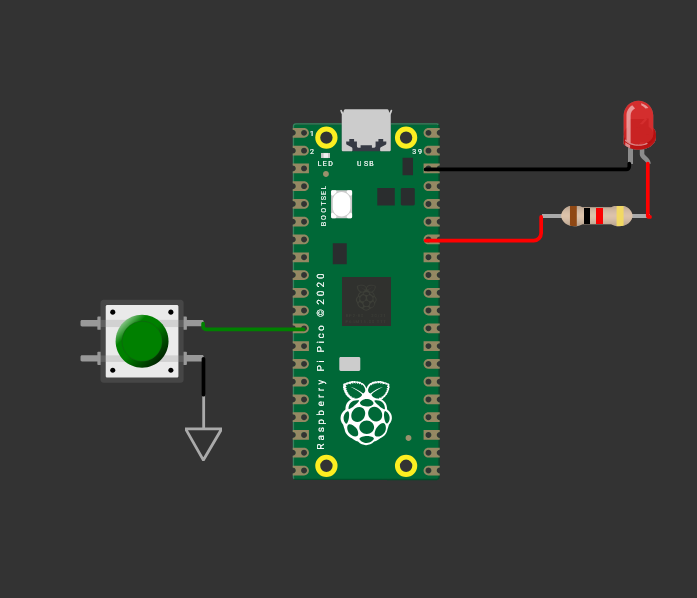
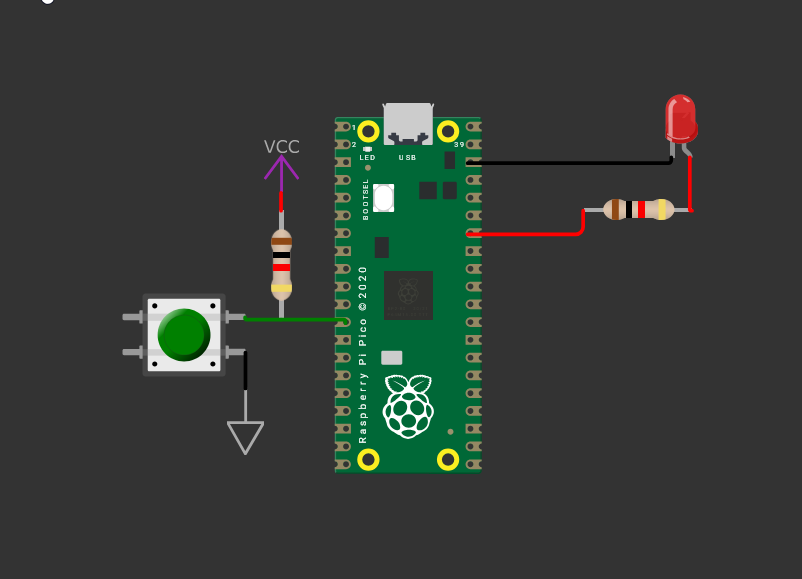
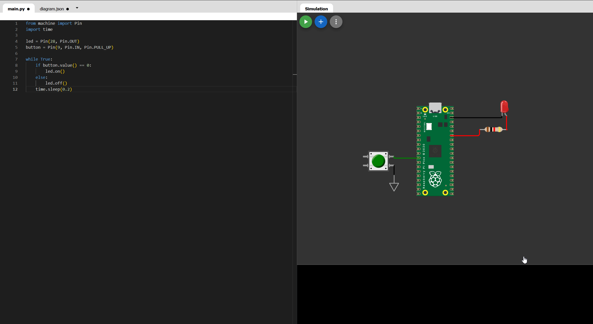
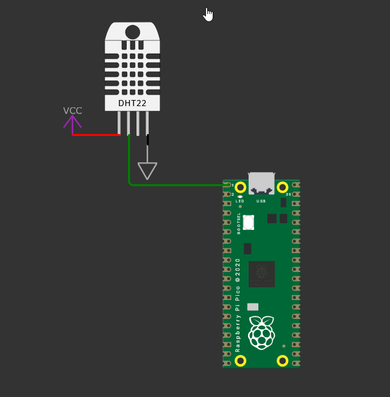
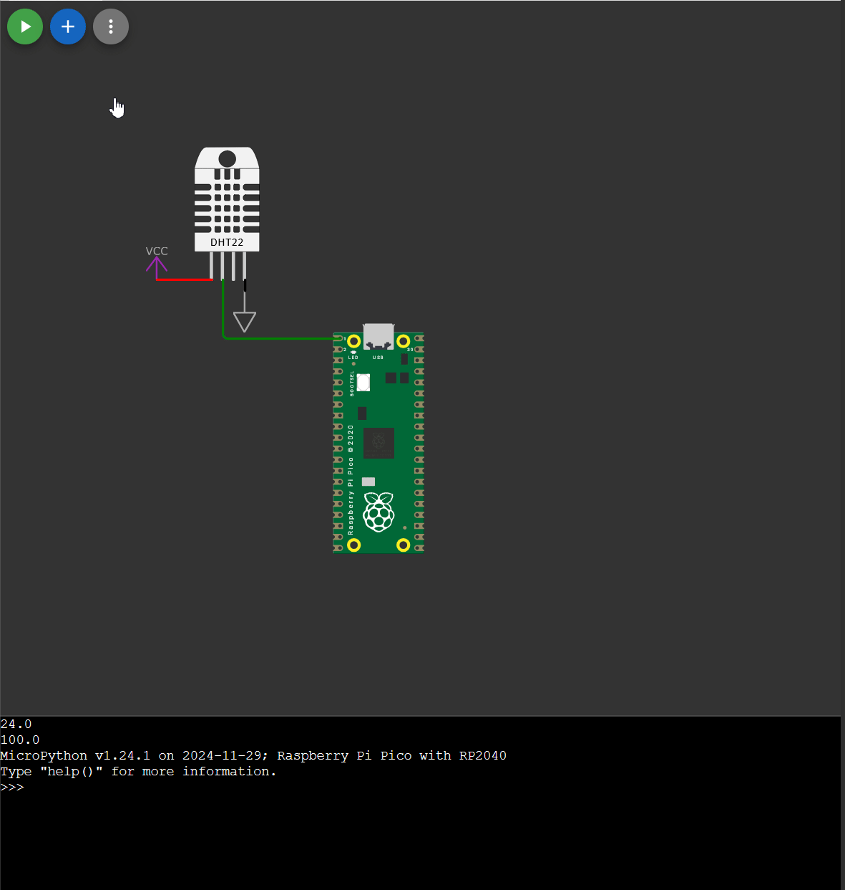

- Intro
	- What we're making
- Digital Electronics
	- Logic Levels
	- GPIO - Input, output and why pins have modes
	- Pull up and pull down resistors
	- Communication protocols - Why they exist
		- I2C
		- SPI & UART
	- Analog Vs Digital Signals
- Meet the Raspberry Pi Pico
	- What's on the board
	- Pinout walkthrough - how to read it and find it
	- Micropython - where to learn it
- Getting Started With Wokwi
	- UI walkthrough
	- Adding componenets, wiring, running code
	- Reading Datasheets and Pinout (Walkthrough)
	- Writing Code
- Your Challenge
    - Use at least one sensor and one output
    - Available components: DHT22, LDR, ultrasonic sensor, buttons, buzzer, SSD1306 OLED, LED matrix, passives
    - Start by reading the datasheet for your chosen components
    - Figure out the wiring yourself — you have the pinout and the datasheet
- Submitting
    - Requirements

----

# Week 6

## Intro

This week we're trying something new and venturing into digital territory, working with microcontrollers! We'll be simulating everything online using a tool called Wokwi, so no hardware needed. Let's build something cool!

## Digital Electronics

Digital electronics, in a nutshell, is anything that works with discrete signals, specifically 1s and 0s, or HIGHs and LOWs. This is different from analog, which deals with continuously varying signals like sound or light intensity. Rather than a value that can be anything in a range, digital signals are always one of two states, on or off.

### Logic Levels

It's essential to understand that digital electronics work on **logic levels**. Logic levels define what voltage counts as a HIGH or a LOW signal. If the voltage is above a certain threshold, the signal is read as HIGH, and if it's below that threshold, it's read as LOW.

For example, the Raspberry Pi Pico runs on 3.3V logic, meaning 3.3V represents a HIGH and 0V represents a LOW. The threshold isn't always exactly half though, typically a voltage of around 2V or higher is needed for the Pico to read a signal as HIGH. Anything below that is treated as LOW.


Logic levels have changed a lot over the years. Early digital circuits ran on 12V logic, which was power hungry and bulky. Over time this came down to 5V, which became the standard for a long time and is still common today on boards like the Arduino Uno. Modern microcontrollers like the Pico have moved to 3.3V, which is more power efficient and better suited for smaller, faster chips. This is worth keeping in mind when mixing components, a 5V signal sent into a 3.3V pin can damage it!

### GPIO

GPIO stands for General Purpose Input/Output, and these are exactly what they sound like: pins on your microcontroller that you can configure and use however you need. Each GPIO pin can be set as either an input or an output depending on what you want to do with it.

When set as an **output**, the microcontroller controls the pin, driving it HIGH or LOW to do things like turn on an LED or trigger a buzzer. When set as an **input**, the microcontroller listens to the pin, reading whether it's being driven HIGH or LOW by something external, like a button or a sensor. This is why pins have modes; the microcontroller needs to know which direction the signal is flowing before it can do anything useful with it.

### Pull-up and Pull-down Resistors

This is an important concept in digital electronics, and one that catches a lot of people off guard at first. When an input pin is connected to nothing, it doesn't just sit quietly at LOW. Instead it floats, picking up random electrical noise from the environment and giving you unpredictable readings. This is called a floating pin, and it's a problem.

Pull-up and pull-down resistors solve this by tying the pin to a known voltage when nothing else is driving it. A pull-up resistor connects the pin to VCC (HIGH), so it defaults to HIGH when idle. A pull-down resistor connects the pin to GND (LOW), so it defaults to LOW when idle. Either way, the pin always has a well-defined state, and your circuit behaves predictably.


### Communication Protocols

So far we've talked about pins that are simply HIGH or LOW, but what if you need to send more complex information, like a temperature reading or a string of text? That's where communication protocols come in. A communication protocol is an agreed-upon set of rules for how two devices exchange data over a wire.

For example, the SSD1306 OLED display uses a protocol called I2C, which sends data over just two wires: SDA (data) and SCL (clock). Rather than needing a separate pin for every piece of information, the devices take turns talking over the same two wires in a structured way. Other common protocols you'll come across are SPI and UART, each with their own tradeoffs in speed, complexity and number of wires needed.

### Analog Vs Digital Signals

You're likely already familiar with analog signals, a voltage that varies continuously across a range, like a microphone picking up sound or a potentiometer being turned. Digital signals, as we covered earlier, are the opposite: strictly HIGH or LOW with nothing in between.

The interesting part is that microcontrollers like the Pico are digital devices, but the real world is analog. To bridge this gap, the Pico has pins with an ADC (Analog to Digital Converter) built in. The ADC samples an analog voltage and converts it into a number your code can work with. This is exactly how you'd read something like an LDR or a temperature sensor that outputs a varying voltage, the ADC turns that continuous signal into a digital value you can actually use.

## Meet The Raspberry Pi Pico

We'll be using the Raspberry Pi Pico as our MCU! It's a small, affordable and incredibly capable microcontroller board made by Raspberry Pi. At its heart is the RP2040 chip, a dual-core processor running at up to 133MHz with 264KB of RAM and 2MB of flash storage for your code. It has 26 GPIO pins, hardware support for I2C, SPI and UART, and runs on 3.3V logic. It can be powered over USB or through its VSYS pin.


### What's On The Board?

The Pico is pretty minimal by design, which is a good thing. On the board you'll find the RP2040 chip front and center, a micro-USB port for power and programming, a BOOTSEL button used to put the board into programming mode, a small onboard LED connected to GPIO 25, and two rows of pins along the edges that give you access to everything the chip can do.

### Pinout

The pinout is a diagram that maps every physical pin on the board to what it actually does, and it's something you'll be referencing constantly. Without it you're just guessing which pin is which, so getting comfortable with it early is important.

Finding a pinout is easy, just Google the board name followed by "pinout" and you'll get plenty of clear diagrams. When reading it, you'll notice each pin often has multiple labels. That's because most pins are multifunctional, a pin might be usable as a regular GPIO, or as an I2C SDA line, or as a SPI signal, depending on how you configure it in code. The pinout tells you what each pin is capable of so you can pick the right one for the job.


## Getting Starting With Wokwi

Wokwi is a free online electronics simulator that lets you build and test circuits right in your browser, no hardware needed. You can simulate a huge range of microcontrollers and components, and it's a great way to prototype and experiment without worrying about damaging anything. To get started, head over to [https://wokwi.com/](https://wokwi.com/), create a new project with the Raspberry Pi Pico and open the MicroPython starter template.


Once you're in a project, hit the run button to start your simulation. You should see "Hello, Pi Pico!" appear in the console below.


That console is your terminal output, it's where your code can print text, sensor readings, debug messages or anything else you want to log. You'll be using it a lot.

### Adding Components

To add components, click the little plus icon in the editor and place them onto the canvas. To demonstrate, I'll wire up an LED. I'll place the LED and a 1K current limiting resistor, rotating the resistor into place using `R`, then wire everything up: the cathode to GND and the anode to 3.3V through the resistor.



While I'm here, I'll also color the wires by selecting them and choosing an appropriate color. It's standard practice to use black for ground and red for positive voltage, which makes your circuit much easier to read at a glance.



Hit run, and the LED lights up!



### Controlling the LED

Now instead of just connecting the LED to 3.3V, how about we control it with a GPIO pin and toggle it using code!

I'll connect the LED to GP28 and write a quick script to initialize the pin and then make it blink!



Here's the code for that:

```
from machine import Pin
import time

pin = Pin(28, Pin.OUT) #Initalizing the GPIO as an output

while True:
    pin.on()      # HIGH
    time.sleep(0.5)
    pin.off()     # LOW
    time.sleep(0.5)
```

How do you figure out what code to write? You read the [docs](https://docs.micropython.org/en/latest/rp2/quickref.html#)! The MicroPython documentation covers everything you need, and getting comfortable looking things up there is a skill that will serve you well.

Let's spice it up a bit and add a button to control the LED. With a button, you connect one end to either GND or VCC and the other end to a GPIO pin. When you press the button, the GPIO reads a HIGH or LOW depending on which side you connected.



But what happens when the button isn't pressed? The pin is connected to nothing, so it floats, and as we covered earlier that's bad news. The fix is a pull-up or pull-down resistor. A 10K or higher resistor ties the pin to a known state so it's always well defined, even when the button is open.



Now the pin always has a defined state!

Here's the fun part though: most microcontrollers, including the Pico, have weak pull-up and pull-down resistors built right into the chip that you can activate in code. So in practice you don't actually need the physical resistor here at all, you can just enable the internal pull-up in your script.

```
from machine import Pin   # Import Pin class to control GPIO
import time               # Import time module for delays

led = Pin(28, Pin.OUT)   # Set GPIO 28 as an output (LED)
button = Pin(9, Pin.IN, Pin.PULL_UP)  # Set GPIO 9 as input with internal pull-up resistor

while True:    
    # Check button state
    # With pull-up: 
    # - Not pressed → reads 1 (HIGH)
    # - Pressed → reads 0 (connected to GND)
    if button.value() == 0:
        led.on()   # Turn LED ON when button is pressed (LOW)
    else:
        led.off()  # Turn LED OFF when button is not pressed (HIGH)
    
    time.sleep(0.2)  # Small delay to reduce CPU usage and simple debounce
```

Press the button and the LED lights up!



As you move forward you'll find that most of what changes between projects is the code, the wiring patterns stay pretty similar. The best way to get comfortable with MicroPython is to read the docs, look at examples and experiment. We won't be walking through every line from here on out, but everything you need is in the official Raspberry Pi Pico and MicroPython documentation.

### Using Sensors

Let's add a sensor! I'll place the DHT22 and wire it up. You can click the little question mark above any component in Wokwi to open up its part reference, where you'll find the pin names and other useful info.

You'll notice the DHT22 only has a SDA pin for data, so I'll connect it to an SDA pin on the Pico. Worth noting that the SDA label here is a bit misleading as this isn't actually I2C, it's a single wire protocol, so you could technically connect it to any GPIO pin. We'll keep it on SDA for now though.



Once it's wired up, finding the code is as simple as searching online. I found a [MicroPython](https://docs.micropython.org/en/latest/esp8266/tutorial/dht.html) example written for the ESP8266, but the code works just the same on the Pico since MicroPython is largely consistent across boards.

```
import dht
import machine
d = dht.DHT11(machine.Pin(0)) #It's connected to GPIO 0

d.measure()
print(d.temperature)
print(d.humidity)

```



Now that we have live temperature and humidity data, we can actually do something with it! For example you could light up an LED when the temperature goes above a threshold, or trigger a buzzer when humidity gets too high. The sensor data is just a number in your code, what you do with it is up to you.

## Your Challenge

>You **MUST** use Lapse for this week!!

Now it's your turn! Your challenge this week is to build your own circuit using at least one sensor and one output. Here are the components you have available to work with:

**Sensors:** DHT22, LDR, Ultrasonic Sensor, Button

**Outputs:** Buzzer, SSD1306 OLED, LED Matrix

**Plus any passives you need:** resistors, capacitors, etc.

The catch is that I'm not going to tell you how to wire it up. That's for you to figure out! Here's how to approach it:

1. Pick your components and decide what you want to build
2. Search up the pinout for each component and understand what each pin does
3. Use the pinout and the Pico pinout to figure out the wiring yourself
4. Write your code using the MicroPython docs as your reference

This might feel unfamiliar at first but this is exactly how real electronics work. Every component you'll ever use has a pinout, and knowing how to read one is one of the most valuable skills you can build. Give it a go!

## Submitting

Now that everything is done, you can get ready to submit your project. Make sure your GitHub repository includes the following:

- A detailed `README.md`
- Wokwi Source Files (Save->Download Project as Zip)

You also need to ensure that your repository is formatted nicely. An example structure could look like this:

```
project-root/
├─ attachments/
│  ├─ image1.png
│  ├─ image2.png
│  └─ image3.png
├─ src/
|  └─ wokwi_source.zip
└─ README.md
```

In your `README.md`, make sure you include the following:

- [ ] A Title
- [ ] What the project is
- [ ] Demo GIF of the project
- [ ] Link to the simulation (Link can be found by pressing the share button)
- [ ] Anything fun you wanna add :D
