  - Intro
    - What we're making
    - Prerequisites
- Making a devboard
    - Planning
        - Parts Selection
        - Reading Datasheets
    - Schematic
        - easyeda2kicad
    - PCB
    - DRC
- Submitting

---

# Week 7

## Intro

This week you'll be designing your very own development board! Ever looked at a Raspberry Pi Pico or an ESP32 board and thought "these are so cool, but it would be even cooler if it had X"? Well, now's your chance to build your own and add whatever features you want!

### Prerequisites

This guide assumes you already know how to use KiCad, are familiar with common schematic and PCB practices, and know how to read datasheets. If any of that sounds unfamiliar, please go through the previous guides before starting this one, as this guide won't be covering the KiCad basics.

## Making A Devboard!

### Planning

A theme that keeps coming up across all the guides: always start with planning! You should NEVER jump into a project without thinking it through first. Start by asking yourself what kind of board you want, what features it should have, and what problem it's solving. Think about things like: does it need to be small? Does it need to be wireless? Does it need specific connectors or sensors? Does it need to be battery powered? The more thought you put in here, the smoother the rest of the process will be.

For my board, I know I want to create a small square board that I can put on a keychain and carry anywhere!

#### Constraints and Requirements

In terms of constraints this week, your PCB has to be under 100mmx100mm and the price of your parts BOM (excluding shippings) has to be under $15. So remember to pick your parts accordingly.

The $15 BOM limit is not a very strict limit and if you go a dollar up or down it's still okay! 

What I don't want to see with your project is a devboard that just follows the hardware design guide and is the same as the board in the guide without any changes. An example of this would be the countless RP2040 boards people make, all of them have the same shape and pinout as the Pico, this is something I do NOT want to see for this week's submissions.

What I also don't want to see is anyone copying the tutorial, you NEED to use a different MCU that what I used in this guide.

Lastly, please make sure to track your time using Lapse or Journalling! 

So in summary:
- PCB under 100mmx100mm
- $15 Parts BOM limit
- No copying existing boards or their designs without adding anything unique (Creating a RP2040 board that looks like a pico is NOT a good submission)
- Do NOT use the MCU that I used in the guide

### Parts Selection

Once your board is planned out, it's time to select your parts: things like your MCU, any sensors, connectors, and so on. We'll be using [LCSC](https://www.lcsc.com/) as our parts supplier this week, so any part you pick should be from LCSC and in stock.

When deciding which MCU to use, think about what your board needs to do and look for chips that check those boxes. Key things to consider are: how much processing power you need, whether you need wireless, what peripherals you need (USB, I2C, SPI, UART, ADC, etc.), how much flash and RAM the project requires, how easy it is to source, and how much supporting circuitry it needs. The less external components a chip requires to run, the simpler your design will be.

If you want wireless, you might go with an ESP32. If you need BLE, a Nordic MCU could be the right call. For something more general purpose, a RP2040 or RP2350 is a great pick. In my case, I want something minimal that has USB and requires as little supporting circuitry as possible, so I'll go with the [STM32F103T8U6](https://www.lcsc.com/product-detail/C19671.html?s_z=n_q_STM32F103T8U6&spm=wm.ssy.bg.0.xh&lcsc_vid=T1UPBgAFQlJbX1JeE1QIVQZeFAcIAwZeQlUPX1BWElcxVlNRQFlaX1RUQFhbXzsOAxUeFF5JWBYZEEoKFBINSQcJGk4dAgUUFAk%3D).

I'm also going with an STM32 because it's something people usually shy away from, and with good reason. MCUs like the RP2040 and ESP32 come with hardware design guides you can Google and follow to get a minimal schematic and PCB recommendations. ST doesn't provide those for their chips since they make so many different ones, so it's a bit more of a challenge. But that's what makes it a good learning experience!

Our MCU also needs a few supporting components to function properly. We'll be constantly jumping between datasheets and LCSC to track those down throughout the design process.

At a minimum, a devboard needs:

1. MCU and supporting circuitry
2. Voltage regulation
3. A programming interface (USB, headers, etc.)
   
In case you want to make a board with the RP2xxx or ESP32 as I previously mentioned, search the chip name + hardware design guide and there are good documents which will guide you though the design process. For example here's the [RP2040 Hardware Design Guide](https://pip-assets.raspberrypi.com/categories/814-rp2040/documents/RP-008279-DS-1-hardware-design-with-rp2040.pdf?disposition=inline).

### Reading Datasheets

Once you've picked your MCU, open up its datasheet. LCSC usually links it right on the part page. You might open it and see 105 pages staring back at you and think "do I have to read this whole thing?" The answer is no. Datasheets contain a lot of data, and we only need the important bits.

The first page, which usually lists the features, is always a great place to start. Skimming through it I can see that this chip runs on 2.0-3.6V, has 64/128 KB of Flash memory (which depends on the part number; the "8" in the part name stands for 64KB, and you can usually find this breakdown at the very end of the datasheet under the ordering info section), has a ton of GPIO, and has a USB interface. Exactly what I want.

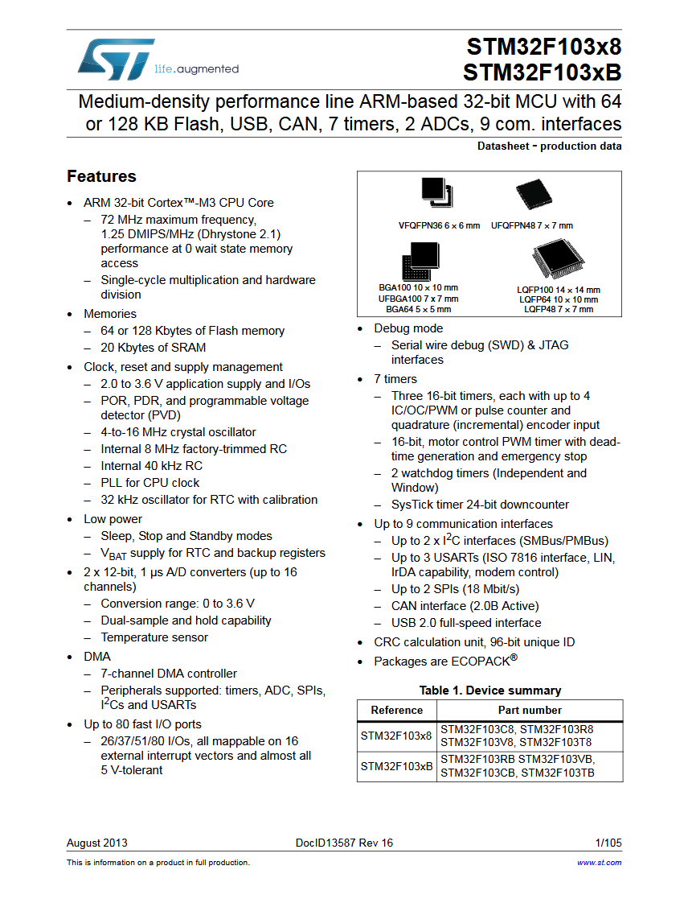

Since USB is a high speed interface, it typically requires an external crystal for precise timing. To confirm whether I need one, I can head to the USB section of the datasheet. And sure enough, it says:

> The STM32F103xx performance line embeds a USB device peripheral compatible with the USB full-speed 12 Mbs. The USB interface implements a full-speed (12 Mbit/s) function interface. It has software-configurable endpoint setting and suspend/resume support. The dedicated 48 MHz clock is generated from the internal main PLL (the clock source must use a HSE crystal oscillator)

The key part there is "HSE crystal oscillator." HSE stands for High Speed External, meaning yes, we do need an external crystal. There are many different types of crystals out there, so we need to find the right one for this chip. Head to the electrical characteristics section and look for the external clock source characteristics table, which you can find using the document outline.

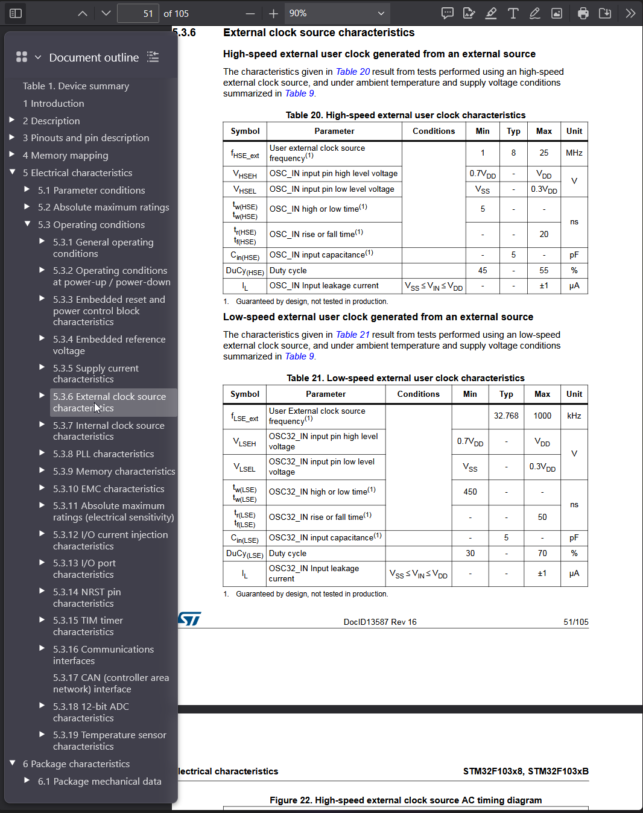

Here you can see the typical external clock frequency is listed as 8MHz. A quick search for an 8MHz crystal oscillator on LCSC turns up a part that fits the bill, so we'll use that when we get to the PCB.

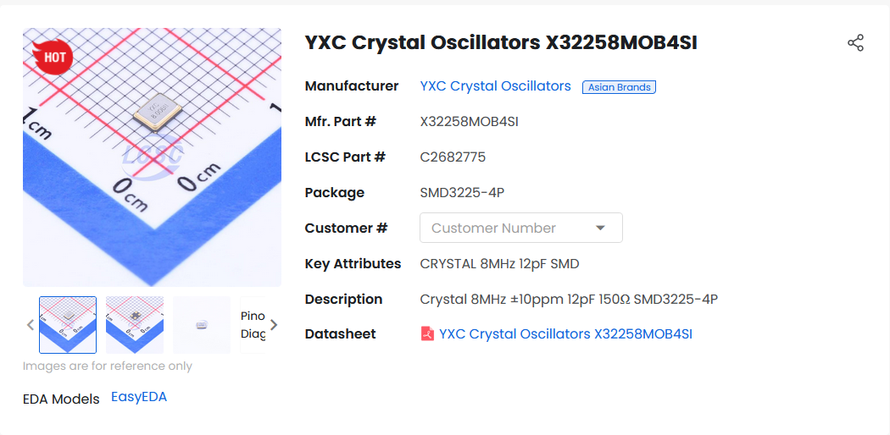

## Schematic

A good order to follow when building your schematic is:

- Power input and voltage regulation
- MCU and minimal circuitry
- I/O like LEDs and buttons
- Extra peripherals or headers

Starting with power input: I'm going to use a USB-C receptacle and an LDO to step the voltage down to 3.3V. You'll want to search for parts on LCSC for this, and when picking an LDO, read its datasheet to make sure it can output enough current for your board. A good tip is to use the [LCSC product index](https://www.lcsc.com/products), search by category (LDO, USB, Microcontrollers, Crystal Oscillators, headers, etc.), and sort by availability. High stock usually means it's a popular and well-supported part.

I'll be using the [MSKSEMI XC6206P332MR-MS](https://www.lcsc.com/product-detail/C5252899.html?spm=wm.fly.bg.1.xh___wm.mly.mlk.16-0-0.ml&lcsc_vid=T1UPBgAFQlJbX1JeE1QIVQZeFAcIAwZeQlUPX1BWElcxVlNRQFlbVF1TQlNcUTsOAxUeFF5JWBYZEEoKFBINSQcJGk4dAgUUFAk%3D) as my LDO, which outputs 250mA at 3.3V and accepts a maximum input of 6.5V. Since I'm powering it from USB (which outputs 5V), that works great. For the USB connector I'll use the [TYPE-C 16PIN 2MD(073)](https://www.lcsc.com/product-detail/C2765186.html?s_z=n_q_TYPE-C%252016PIN%25202MD\(073\)&spm=wm.ssy.bg.0.xh&lcsc_vid=FVBfAQdVQFkIXwYEQFNaA1RVT1gPUFFTEVZZVFdWFAAxVlNRQFlbU1dRT1hXVjsOAxUeFF5JWBYZEEoKFBINSQcJGk4NBhADEA4cHktXR1JcSQwSGg0%3D).

### easyeda2kicad

Let's go ahead and place the symbols in the schematic. You might notice that KiCad doesn't have a symbol or footprint for some of your parts. In that case, we can use a handy little tool called [easyeda2kicad](https://github.com/uPesy/easyeda2kicad.py). Install it by running `pip install easyeda2kicad` (assuming you have pip installed). Once it's installed, set up KiCad like this:

- In KiCad, go to `Preferences` > `Configure Paths...` and set the `EASYEDA2KICAD` variable to:
    - On MacOS: `/Users/<username>/Documents/Kicad/easyeda2kicad`
    - On Linux: `/home/<username>/Documents/Kicad/easyeda2kicad`
    - On Windows: `C:\Users\<username>\Documents\Kicad\easyeda2kicad`
- In the schematic editor, go to `Preferences` > `Manage Symbol Libraries...`. Click the `+` icon to add a new library, name it `easyeda2kicad`, and set the path to: `${EASYEDA2KICAD}/easyeda2kicad.kicad_sym`
- In the PCB editor, go to `Preferences` > `Manage Footprint Libraries...`. Click the `+` icon to add a new library, name it `easyeda2kicad`, and set the path to: `${EASYEDA2KICAD}/easyeda2kicad.pretty`

Once that's done, you can import the symbol and footprint for any LCSC part using: `easyeda2kicad --full --lcsc_id={LCSC PART# HERE}`

---

Most of my parts already have symbols in KiCad so I used the built-in library, but I did need to download the symbol for the USB-C receptacle, which I assigned to KiCad's 16-pin USB symbol.

For the power input section, since I'm using a USB-C receptacle, I also need to add 5.1k pull-downs on the CC pins. The CC pins on USB-C are used for negotiation between the host and device, and pulling them down to ground with 5.1k resistors tells the host that this is a USB device drawing standard power (5V). Without them, the host may not supply power at all. I'll add power flags for VBUS and the LDO output, along with 1uF capacitors on both Vin and Vout. These capacitors act as a small local energy reservoir, smoothing out any sudden voltage spikes or dips that can happen when current demand changes quickly. I'll also assign net flags to the data pins on the USB receptacle.

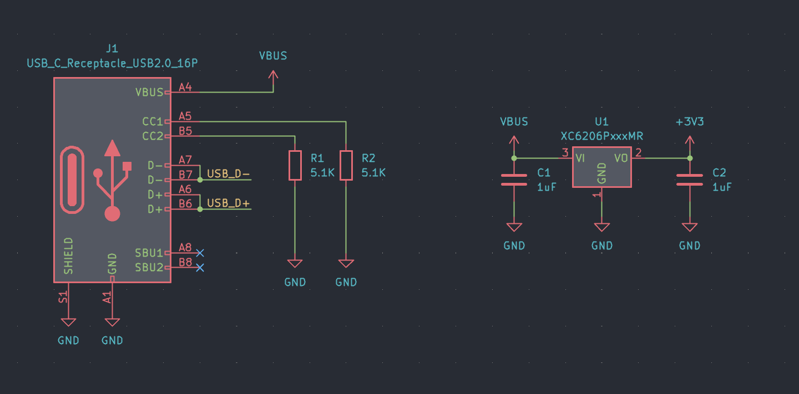

Next, move onto the MCU. Import its symbol, wire up the power pins, and add decoupling capacitors on them. A good rule of thumb is at least one 100nF capacitor per power pin, plus a 1uF bulk capacitor to handle bigger surges. For power pins that are physically close together, they can share one bulk capacitor between them rather than having one each.

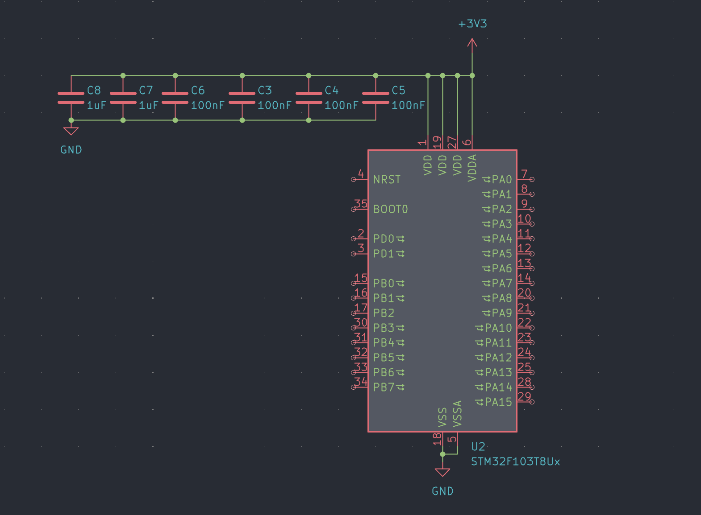

Now let's wire up the external crystal and USB data lines. To figure out which pins to connect them to, refer back to the datasheet. It tells me that `PD0` and `PD1` are OSC_IN and OSC_OUT respectively, and that `PA11` and `PA12` are the USB data lines, so I'll wire up the board accordingly.

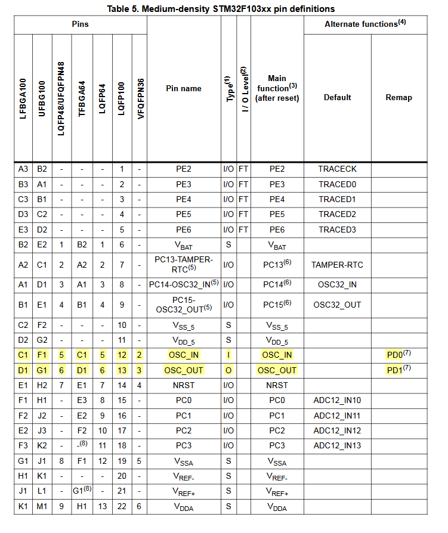

For the crystal, use the Crystal24 footprint if it's a 4-pin crystal, or just Crystal for a 2-pin one.

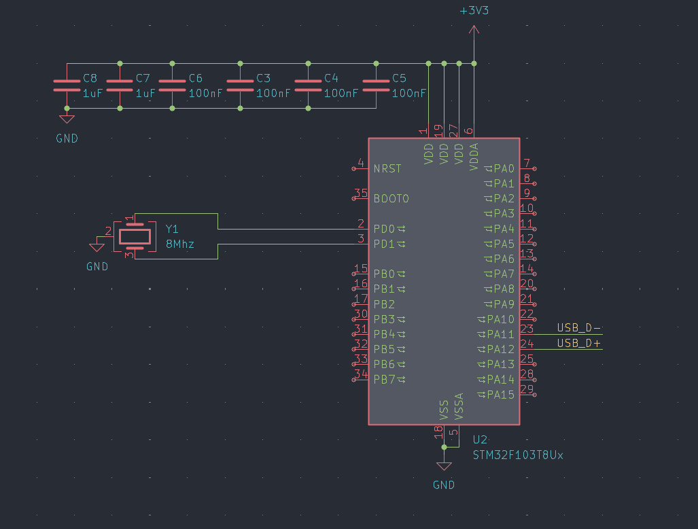

Crystal oscillators also need load capacitors! This is really important. Without them, the crystal can fail to start up or resonate at the wrong frequency. Load capacitors (LC) are just capacitors with one end connected to the crystal's input or output and the other end going to ground. The correct value depends on your specific crystal's load capacitance, and you calculate it like this:

C = 2(CL - Cparasitic)

Where C is the value of each load capacitor, CL is the crystal's load capacitance (12.5pF in my case, found from the crystal datasheet), and Cparasitic is the stray capacitance introduced by the PCB traces, pads, and the crystal's own internal capacitance. It's always present even if you didn't design it in, which is why we subtract it out of the calculation. A good estimate for Cparasitic is 4-6pF.

So for my values:

C = 2(12.5 - 5) C = 15pF

That means I'll be using 15pF load capacitors. Remember, this value is not universal. It's different for every crystal, so you'll need to calculate it yourself!

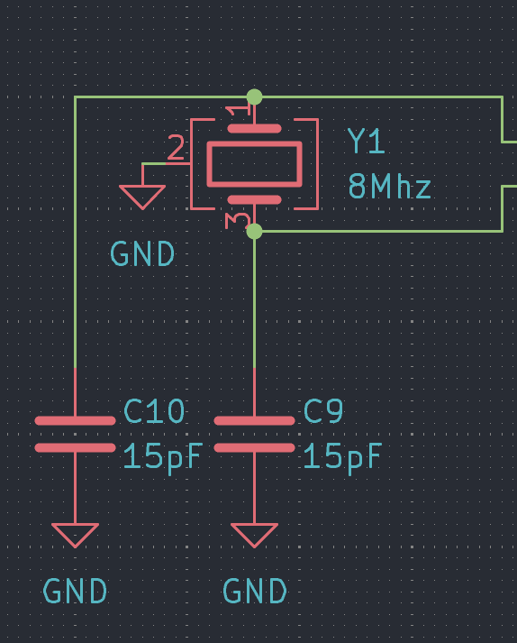

For the NRST and BOOT pins, do a `ctrl+f` search in the datasheet for any mentions of them to find out how to wire them up. For NRST, the datasheet says the pin goes low to trigger a reset, and that it already has an internal pull-up so no external one is needed. It also recommends adding a 0.1uF capacitor between NRST and GND. This helps filter out any noise or glitches on the line that could accidentally trigger a reset.

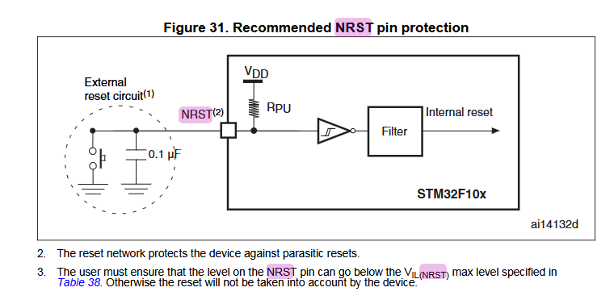

For BOOT0, the datasheet doesn't explicitly say what state it needs to be in to enter bootloader mode, but referencing other documentation or a quick search confirms that BOOT0 needs to be pulled high. That means we need a switch connected to 3.3V and a pull-down resistor on the BOOT0 pin.

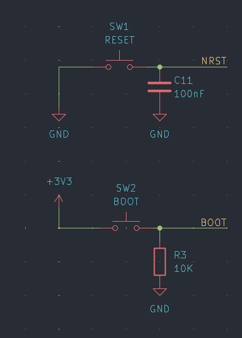

At this point the minimal schematic is done! Now I can add all the extra features I wanted, like status LEDs, headers, and anything else. I'll add them to the schematic now but won't connect them to any pins yet. The plan is to first lay everything out on the PCB, then wire up the extras based on which pins are physically closest to each component, which keeps the routing clean and tidy.

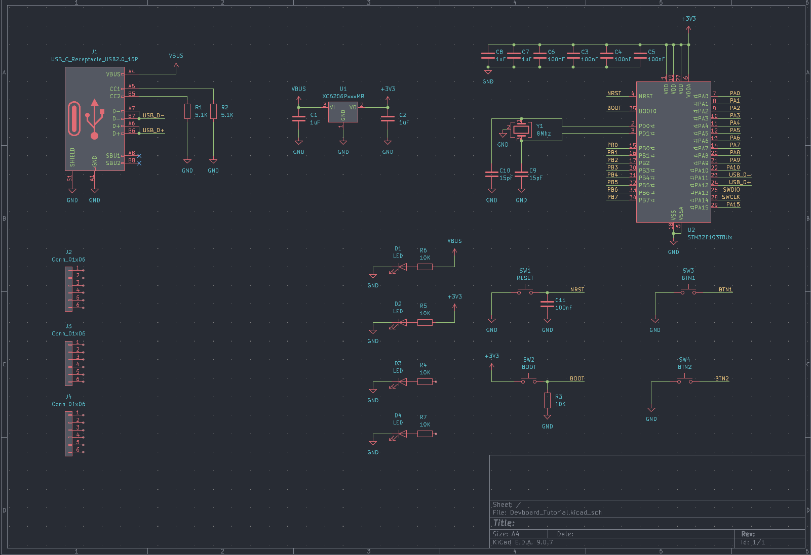

## PCB

Moving onto the PCB, start by assigning footprints for all your parts. Footprints matter a lot here. They need to physically match your parts, so double check before moving on. I'll use the easyeda2kicad footprint for my USB-C receptacle, and for my buttons I'll use the [XUNPU TS-1088-AR02016](https://www.lcsc.com/product-detail/C720477.html?s_z=n_q_TS-1088-AR02016&spm=wm.ssy.bg.0.xh&lcsc_vid=RgJaAgJWRlVeVlBXQVRaBQUFE1JXUFADRQVfXlZXRgcxVlNRQFhdU11fRlRWXjsOAxUeFF5JWBYZEEoKFBINSQcJGk4eFQsCAgIaSgADAwAHC0slRlhYUFVIHxUDCw%3D%3D), whose footprint I downloaded using easyeda2kicad.

For the rest of the parts, KiCad already has footprints ready to go. For the crystal, I can see from the LCSC description that its package is SMD3225, so that's what I'll assign. For all the passives, I'll be using SMD parts. SMD passives come in different package sizes. The common ones from smallest to largest are 0201, 0402, 0603, 0805, and 1206. 0402 is the most widely used size, but they're extremely tiny and tricky to hand solder. If you're newer to soldering, 0603 or 0805 are bigger and much more manageable.

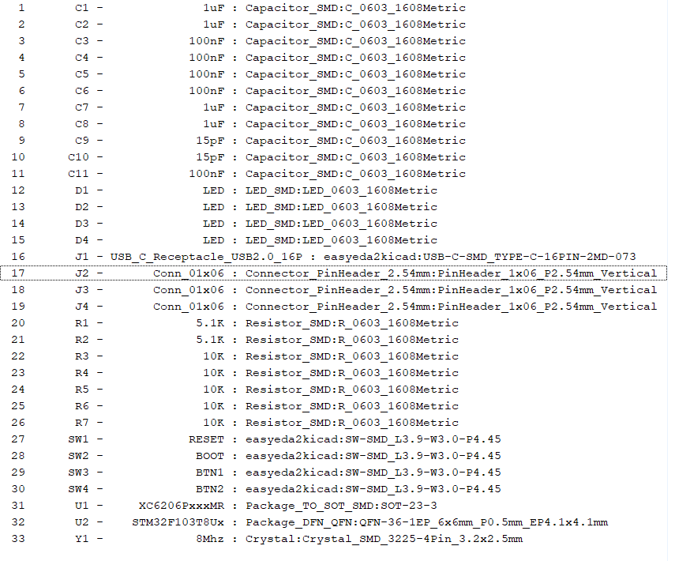

Once all your footprints are imported into the PCB, you can start placing components. Make sure your PCB is under 100x100mm! If routing on 2 layers feels impossible, you can go up to 4 layers.

Since I'm making a small board with a lot of signals to route, I already know I'll want a 4-layer board. If you're unsure, start with 2 layers and switch to 4 if things get too cramped.

A few tips for layout:

1. Hide your Fab layer to keep things looking cleaner
2. Group related components together (decoupling caps close to their respective pins, etc.)
3. Place your MCU first, then build outward from it
4. Keep high-speed components like crystals and USB connectors as close to their MCU pins as possible
5. Think about mechanical constraints early, like where connectors will face and where mounting holes will go

You can click on components in the schematic to highlight them in the PCB editor, which makes placing things a lot easier.

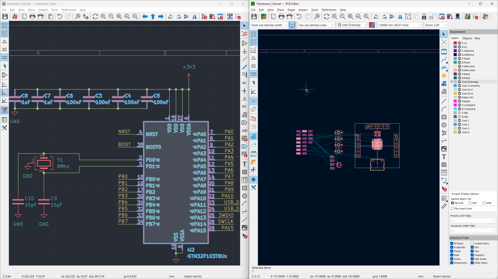

Another cool trick is color-coding specific nets and setting the net display option to show all net colors. This makes it much easier to tell signals apart at a glance. You can take it even further by creating net classes for groups of related nets (like high-speed signals or GPIO) and color coding each class. Look up a quick tutorial on this if you want to set it up.

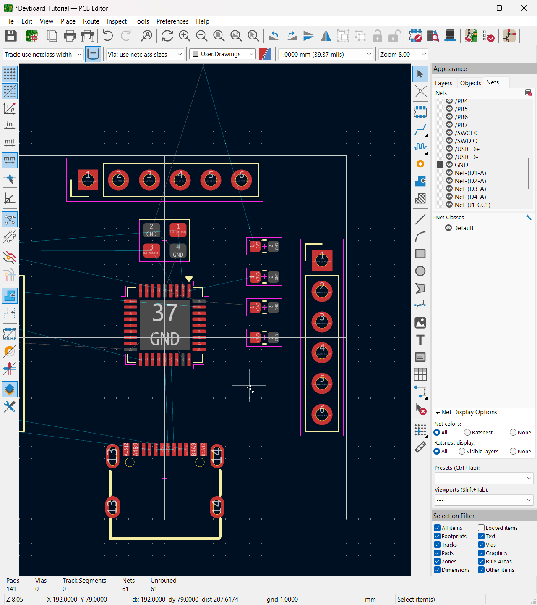

I also noticed that my USB-C footprint pad numbers didn't match the symbol, so I'll right-click the footprint, edit it, double-click the pads, and update their numbers to match the schematic. USB-C connectors have mirrored pins on each side, so the symbol treats them separately as A4, B4, A9, and B9, while the footprint may combine the mirrored pairs into shared pads like A4B9 and B4A9. Updating the pad numbers to match is what lets KiCad correctly connect the two together. Once the footprint is updated, save it and re-import changes from the schematic and it should all line up now.

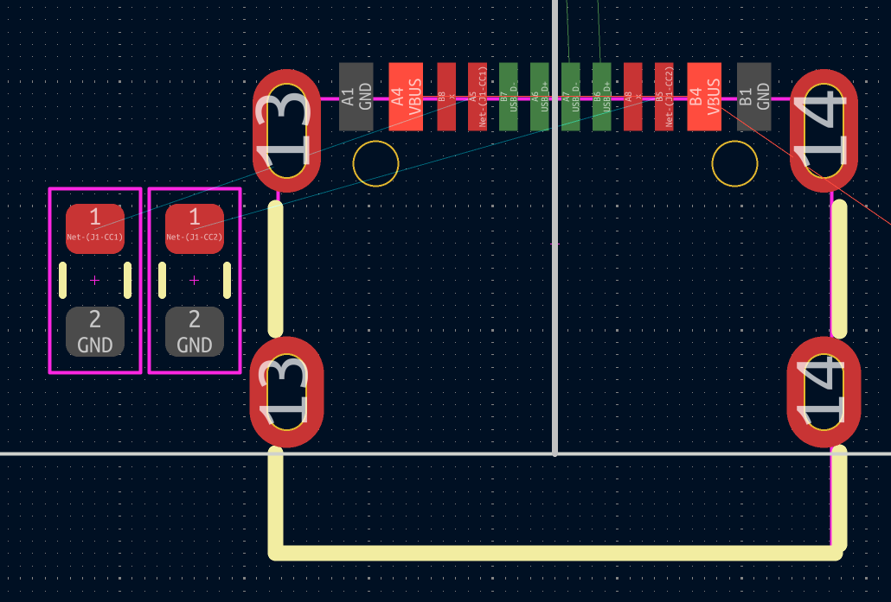

### Routing

For routing order, I'd recommend starting with high-speed and decoupling traces, then moving on to power, and lastly GPIO. This is important: most, if not all, of your traces, especially high-speed signal traces, need a solid ground plane underneath them. Start with a ground pour on the bottom layer if you're on a 2-layer board, or on a dedicated inner layer if you're on 4 layers, and leave connecting ground pads for last. For ground connections, a via going down to the ground plane works great, and aim for one via per pad.

Since I have a 4-layer board, I'll set both inner copper layers as solid ground pours so that the top and bottom layers always have a reference plane underneath them. A reference plane is basically a solid copper layer (usually ground) that runs beneath your signal traces. It gives high-speed signals a controlled return path and helps reduce noise and interference, which is especially important for things like USB. Here's a [good video](https://www.youtube.com/watch?v=ySuUZEjARPY) about reference planes if you want to learn more. 

### Differential Pairs and Controlled Impedances

For USB, you need to route the data lines as a differential pair. A differential pair is two traces that carry equal but opposite signals side by side. The idea is that any noise picked up along the way affects both traces equally, and the receiver cancels it out by looking at the difference between them. This makes the signal much more reliable, especially at higher speeds. You also need to impedance-match the traces. Impedance matching means sizing your trace width and spacing so that the electrical impedance of the trace matches what the standard expects, in this case 90 ohms for USB. When there's a mismatch, part of the signal reflects back down the trace instead of reaching the destination cleanly, which can corrupt data at high speeds. To do this, use [JLCPCB's impedance calculator](https://jlcpcb.com/pcb-impedance-calculator), enter your stackup details, set the impedance to 90 ohms (which is what USB requires), and set the type to differential pair non-coplanar. I'll set the trace spacing to 0.2mm and calculate. The result gives me a trace width of 0.1460mm for the first stackup.

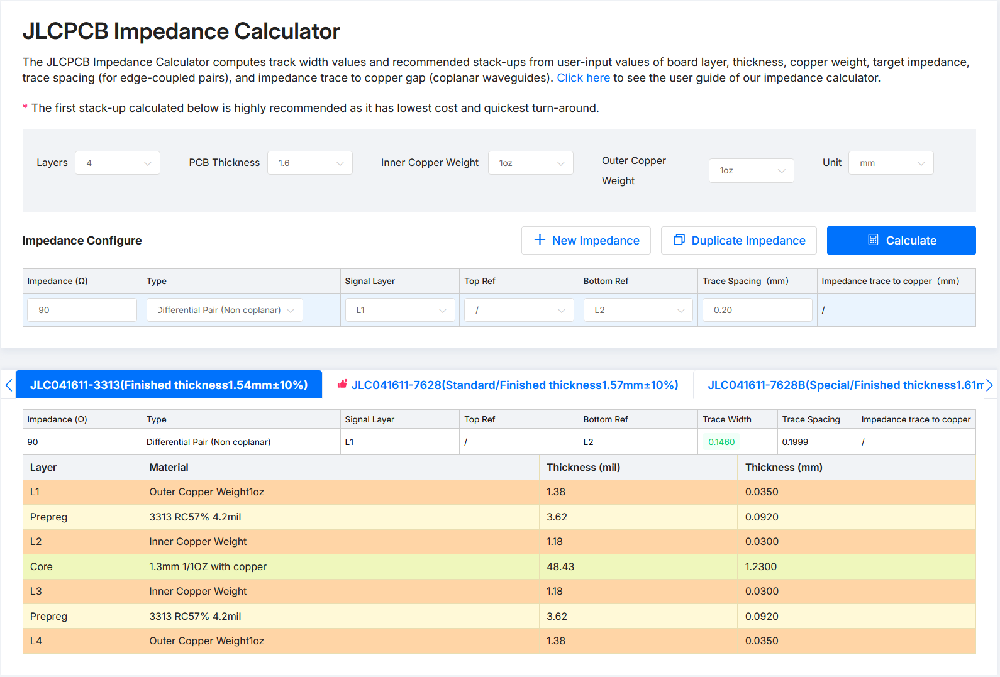

To be fair, for USB 2.0 specifically, controlled impedance isn't super critical and we won't be getting a controlled impedance stackup for this project anyway, but it's still a great concept to understand and practice.

With those numbers, we can set up the differential pair configuration in KiCad by editing a net class and setting the DP width (trace width) and DP gap (spacing between traces).

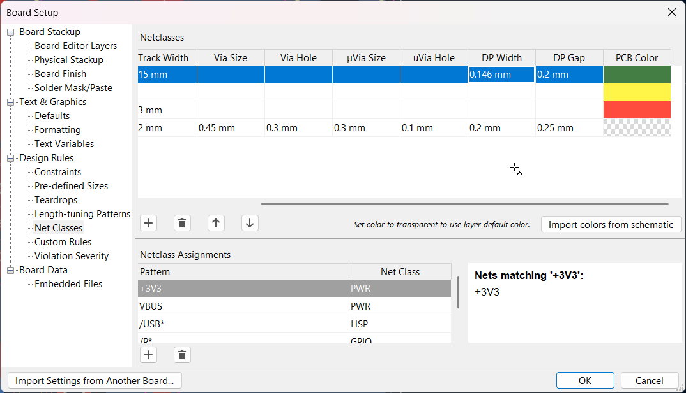

Once you've saved it (make sure it's assigned to the right net class; if you haven't made any custom net classes, it defaults to the default class), press 6 to route your USB lines as a differential pair.

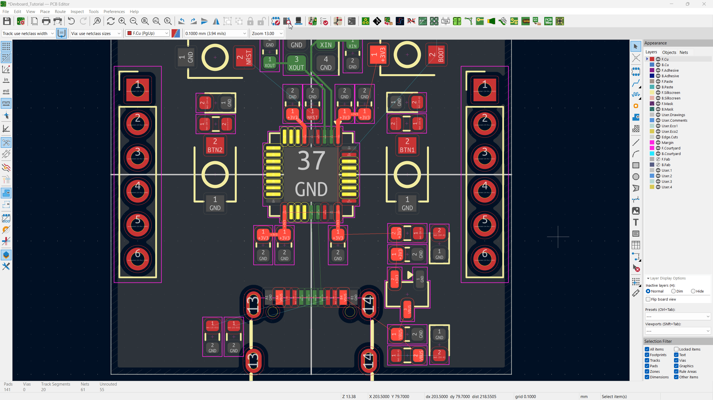

---

Now I'll route out the remaining signals like BOOT, NRST, and the power section. For power traces you can go a bit wider depending on how much current you expect to carry. As a rough guide, a 0.2mm trace can handle around 0.5A, a 0.5mm trace around 1A, and a 1mm trace around 2A, though this also depends on your PCB's copper weight.

For power routing, I'll use the bottom of the board and via up to every 3.3V pad. Try to have at least one via per pad. Each via creates a direct low-resistance connection down to the ground or power plane, and having one per pad ensures that current doesn't have to travel far along the plane to find its return path, which helps keep the voltage stable.

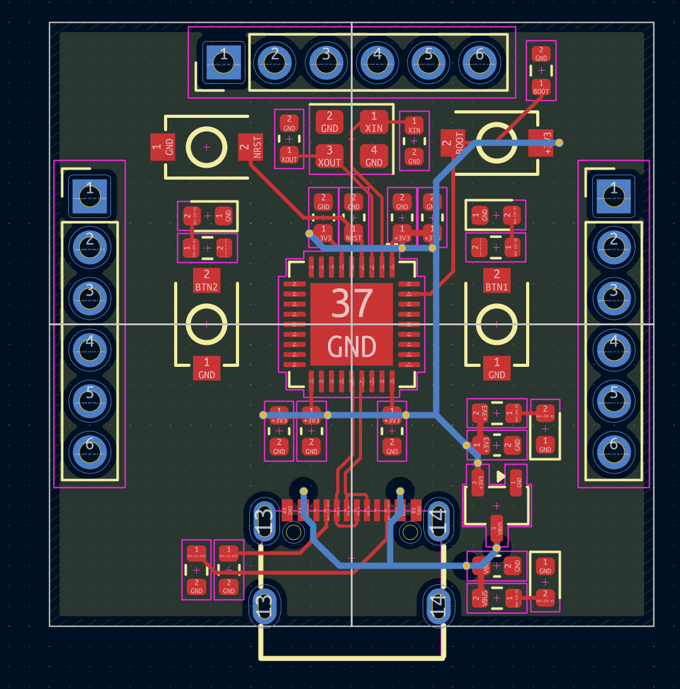

After finishing the power routing, I'll look at what's closest to the headers and buttons in the PCB, click on the pin to highlight it in the schematic, and then wire it up accordingly.

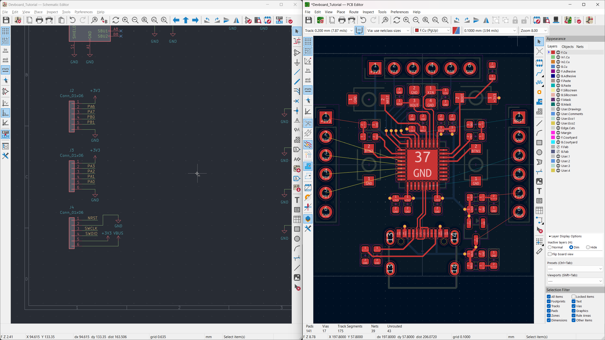

Once everything is routed, it's time to connect all your ground pads to the ground plane with vias. Aim for at least one via to ground per pad, sometimes that's not possible, but do your best. Also try to place vias as close to the pad as possible without being inside it, since solder will get sucked into the via during assembly and make soldering very difficult. The one exception to this rule is the large thermal pad under a chip, where a via-in-pad is actually fine.

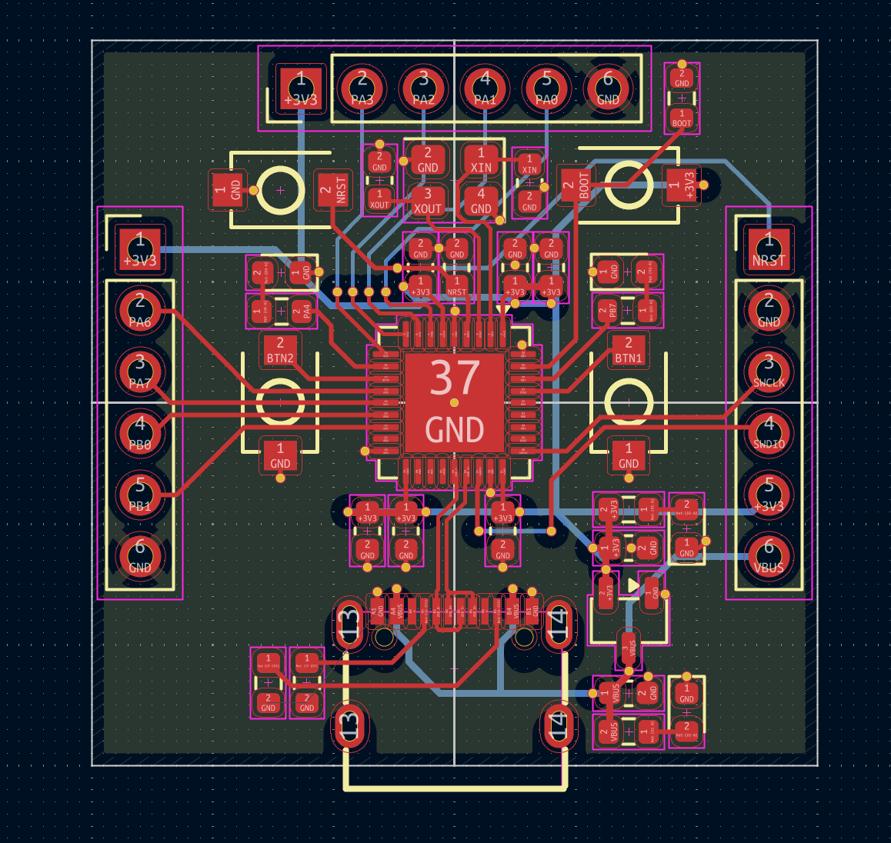

## Polishing

You're not done just yet! Your board might function perfectly, but right now it's probably just a sharp square with no labels. Let's fix that.

### Filleting Edges And Mounting Holes

Two quick things that instantly make a board look more finished: fillet the corners and add mounting holes!

Filleting is easy, just right-click the edge cut, go to Shape Modification, and select Fillet Lines.

For mounting holes, go to your schematic and add a MountingHole symbol, then assign it a MountingHole footprint. I'm going with a 2.1mm hole to fit M2 screws.

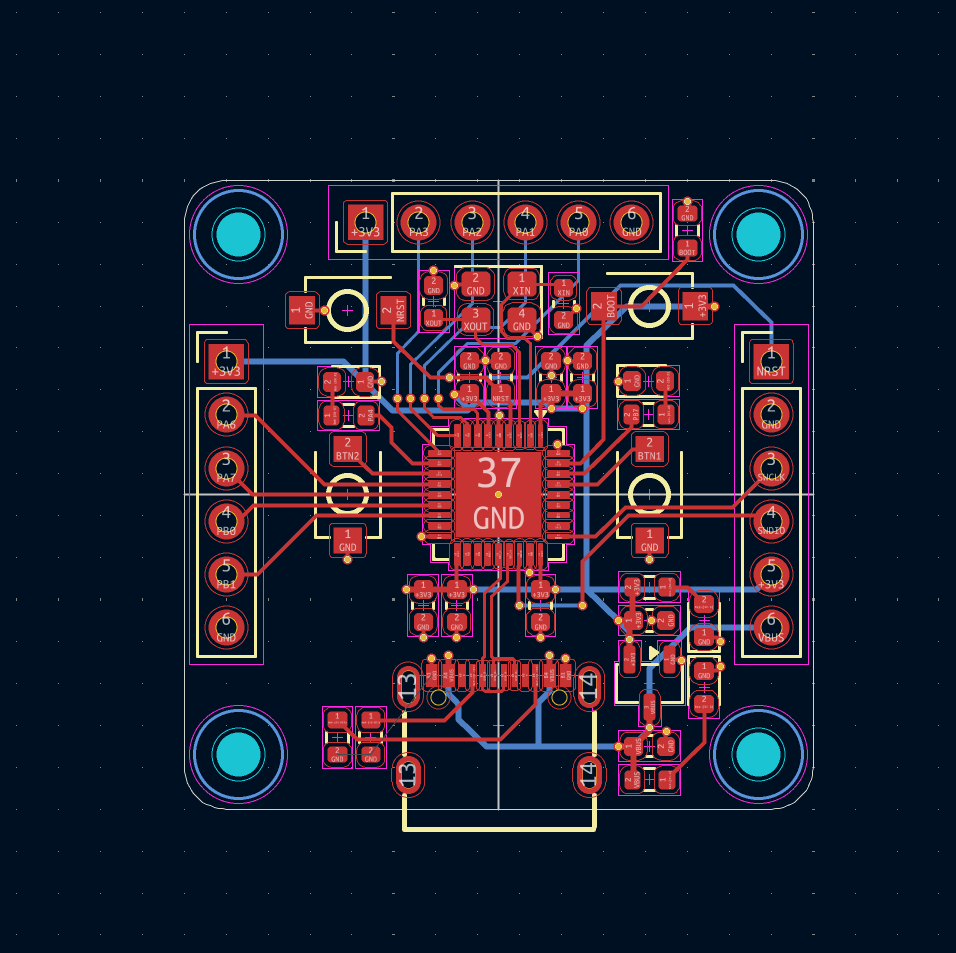

This looks way better already, and if I ever want to make a case for it (subtle foreshadowing), I'll have proper mounting points ready to go.

### Labels

There's still something missing: silkscreen labels. You don't want to have to pull up the schematic every time you need to know which pin is which! Let's fix that by adding labels to the headers showing the pinout, and to the buttons and LEDs as well.

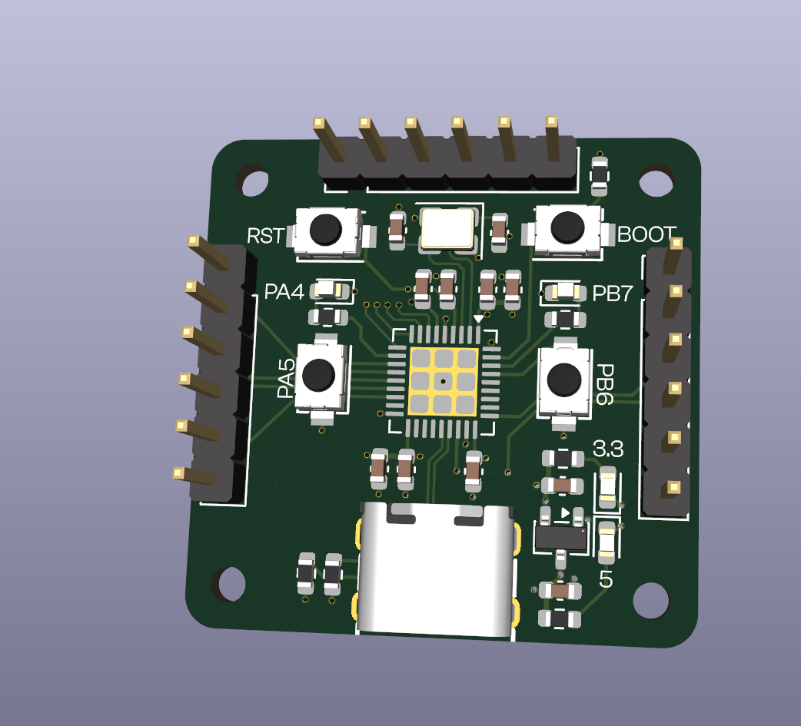 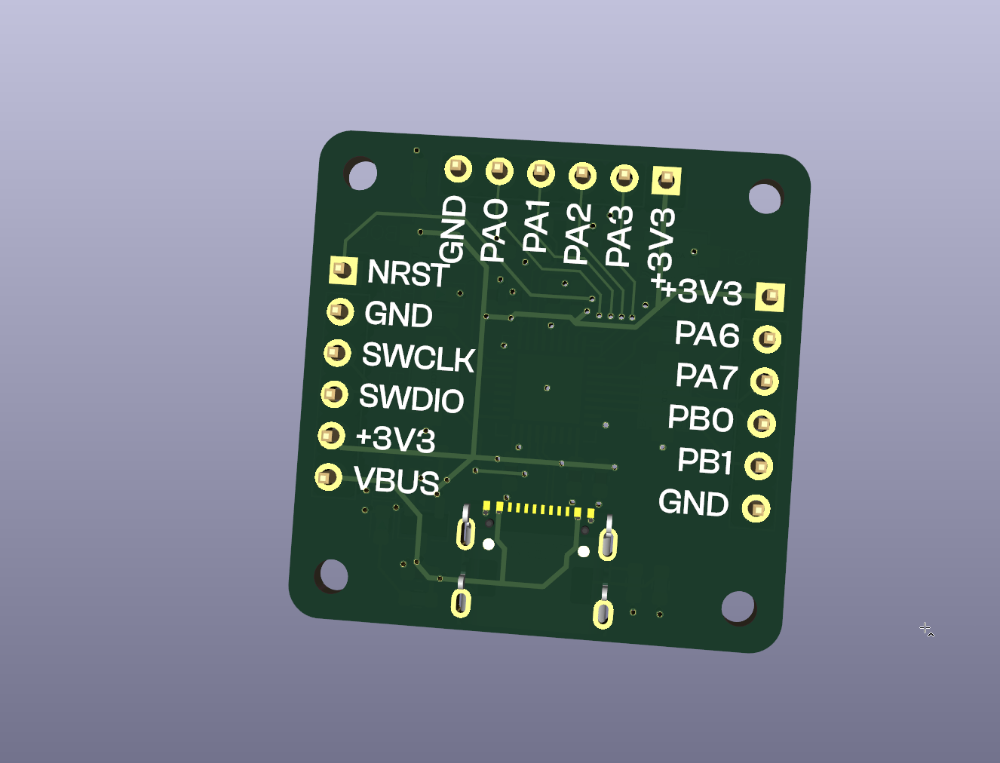

### 3D Models

Now's also a good time to fix up any broken 3D models, or add and remove any that you want. In my case, the STM32 model is missing, I want to remove the header 3D model, and the USB-C connector model placement is a bit off.

You can add, remove, or adjust models by selecting the footprint, pressing `E` to edit it, and going to the 3D Models tab. Here's an example of me adding the STM32 3D model:


I'll remove the header 3D model by deleting it from its properties, and adjust the USB-C model's XYZ offset to snap it into place.

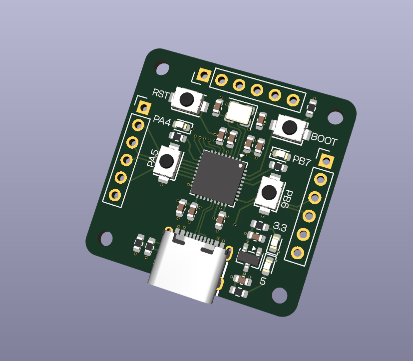

So much cleaner and more polished!!

## Getting It Ready For Production

Now that the PCB is done, it's time to get it production-ready. Give your board one final look, run DRC, and make sure everything checks out. Confirm you have a power input, that voltage regulation is wired correctly, that your MCU has all its required supporting components, and that there's a way to program the board. Also double check that all your footprints match the actual parts you're planning to use, and that your board dimensions are within the 100x100mm limit.

Next, since we're using parts from LCSC, every part needs an LCSC part number assigned to it. In the schematic editor, go to Tools and click Edit Symbol Fields. You should see an `LCSC Part` field; if not, click the plus icon on the left to create one, make sure the name of the field is `LCSC Part`. Then go through each part and fill in the correct LCSC part number, making sure everything matches what you actually plan to use (footprint, voltage rating, etc.).

Finding part numbers on LCSC is pretty straightforward. For example, if I need a part number for a 1uF 0603 capacitor, I just search "1uF 0603 capacitor" and look for one with a voltage rating higher than the maximum voltage in my project. Anything above 5V is fine here, and doubling your max voltage as a rule of thumb is always a safe bet.

The first result on LCSC looks solid, so I'll copy its part number and paste it into the correct field in KiCad.

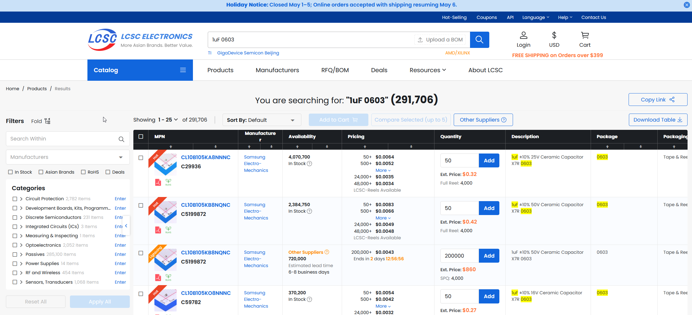

I'm leaving the LCSC Part blank for the headers since I won't be populating them, and the same goes for the mounting holes since there's no associated part.

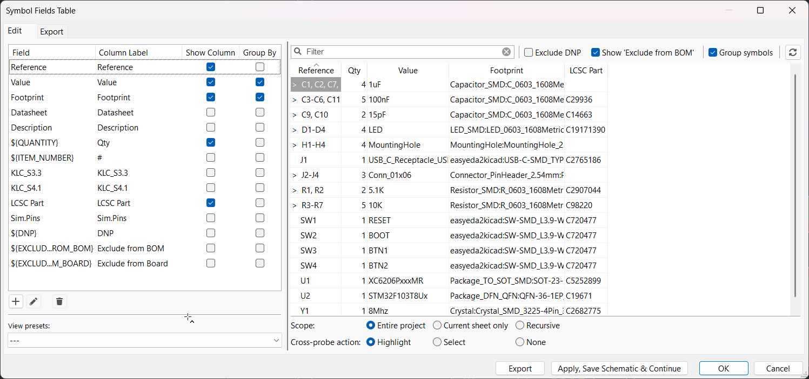

Once all the part numbers are filled in, save it, update your PCB from schematic and move on to exporting your project using the JLCPCB fabrication toolkit. Generate your Gerbers and production files, and you're ready to submit!

Just to double check that your BOM exported correctly take that file and go to LCSC and click on upload a BOM and use the one you just generated to create a BOM, if it's successful and you see all the parts, you did it correctly! 
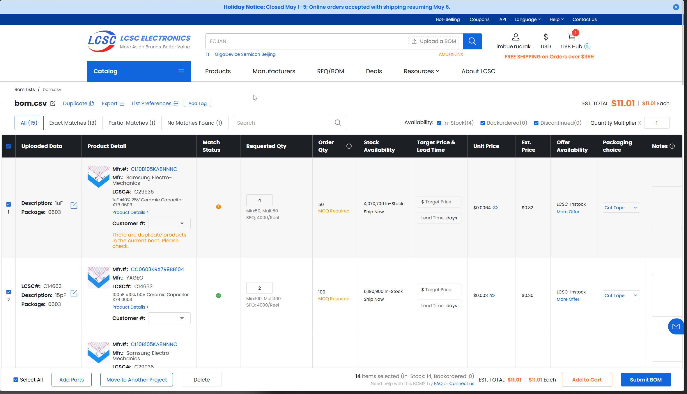

Here is also a good way to see how much your BOM costs and if it's under our constraint.

## Submitting

Now that everything is done, get ready to submit your project. Make sure your GitHub repository includes the following:

- A detailed `README.md`
- A `Journal.md` (if you are journaling your progress)
- KiCad source files (`.sch`, `.pcb`, `.prj`)
- Production files (Gerbers)

Your repository should also be structured cleanly. Here's an example layout:

```
project-root/
├─ attachments/
│  ├─ image1.png
│  ├─ image2.png
│  └─ image3.png
├─ production/
│  ├─ gerber.zip
│  ├─ bom.csv
│  ├─ designator.csv
│  ├─ position.csv
│  └─ netlist.ipc
├─ src/
│  ├─ kicad/
│  │  ├─ kicad.sch
│  │  ├─ kicad.pcb
│  │  └─ kicad.prj
│  └─ falstad/
│     └─ falstad.txt (if required)
├─ Journal.md
└─ README.md
```

In your `README.md`, make sure you include:

- [ ] A Title
- [ ] Project Overview
- [ ] PCB Render Image
- [ ] Schematic Image
- [ ] PCB Image


For your demo link please use a KiCanvas link.

Here's an example of a minimal submission that I made: https://github.com/Outdatedcandy92/TinySTM32

Your submission for this week have to be on par if not better than the submission above. Things you can consider adding are a pinout graphic, a 3D render, and more.